# PetLink - Complete System Class Diagram

This file contains the complete system class diagram for the **PetLink** application. It illustrates the inheritance structure of the user types (User, PetOwner, Seller, Buyer, ShelterOwner, Admin), the AI chatbot ecosystem, the e-commerce entities, the pet profile/marketplace core modules, and external integrations (Stripe, Google Maps).

```mermaid
classDiagram
    direction TB

    %% ==========================================
    %% USER INHERITANCE HIERARCHY
    %% ==========================================
    class User {
        +String userId
        +String name
        +String email
        +String passwordHash
        +String role
        +String phone
        +String address
        +Date createdAt
        +register() Boolean
        +login() String
        +updateProfile(data) Boolean
        +logout() Boolean
        +resetPassword(email) Boolean
    }

    class PetOwner {
        +List~PetProfile~ pets
        +addPetProfile(details) PetProfile
        +updatePetProfile(petId, details) Boolean
        +deletePetProfile(petId) Boolean
        +requestBoarding(shelterId, petId, dates) ShelterRequest
        +addHealthRecord(petId, record) HealthRecord
    }

    class Seller {
        +List~MarketplaceListing~ listings
        +createListing(petId, type, price, desc) MarketplaceListing
        +updateListing(listingId, details) Boolean
        +markAsSold(listingId) Boolean
        +deleteListing(listingId) Boolean
    }

    class Buyer {
        +Cart cart
        +List~Order~ orderHistory
        +addToCart(productId, quantity) Boolean
        +removeFromCart(productId) Boolean
        +checkout(shippingAddress) Order
        +makePayment(orderId, cardDetails) Boolean
        +submitFeedback(listingId, rating, text) Boolean
    }

    class ShelterOwner {
        +String shelterName
        +String shelterDescription
        +int capacity
        +List~ShelterRequest~ activeBookings
        +updateShelterDetails(details) Boolean
        +acceptBooking(requestId) Boolean
        +rejectBooking(requestId, reason) Boolean
        +updateAvailability(status) Boolean
    }

    class Admin {
        +String permissions
        +String accessLevel
        +addProduct(details) Product
        +updateProduct(productId, details) Boolean
        +deleteProduct(productId) Boolean
        +manageUsers(userId, action) Boolean
        +viewReports() List~Report~
        +updateOrderStatus(orderId, status) Boolean
    }

    %% User Inheritance Connections
    PetOwner --|> User
    Seller --|> User
    Buyer --|> User
    ShelterOwner --|> User
    Admin --|> User

    %% ==========================================
    %% PETS & MARKETPLACE CORE CLASSES
    %% ==========================================
    class PetProfile {
        +String petId
        +String ownerId
        +String name
        +String species
        +String breed
        +int ageMonths
        +float weightKg
        +String medicalHistory
        +String imageUrl
        +Date createdAt
        +createProfile() Boolean
        +updateProfile(data) Boolean
        +deleteProfile() Boolean
        +getHealthRecords() List~HealthRecord~
    }

    class MarketplaceListing {
        +String listingId
        +String petId
        +String sellerId
        +String type
        +float price
        +String description
        +String status
        +Date createdAt
        +createListing() Boolean
        +updateListing(data) Boolean
        +markAsCompleted(status) Boolean
        +deleteListing() Boolean
    }

    class ShelterRequest {
        +String requestId
        +String petOwnerId
        +String providerId
        +String petId
        +Date startDate
        +Date endDate
        +String status
        +String notes
        +Date createdAt
        +submitRequest() Boolean
        +updateStatus(status) Boolean
        +cancelRequest() Boolean
    }

    %% Marketplace & Shelter Relationships
    PetOwner "1" o-- "*" PetProfile : owns
    Seller "1" --> "*" MarketplaceListing : creates
    PetProfile "1" <-- "1" MarketplaceListing : references
    PetProfile "1" <-- "1" ShelterRequest : boards
    PetOwner "1" --> "*" ShelterRequest : requests (Owner)
    ShelterOwner "1" --> "*" ShelterRequest : manages (Provider)

    %% ==========================================
    %% HEALTH & REMINDERS
    %% ==========================================
    class HealthRecord {
        +String recordId
        +String petId
        +String vaccineName
        +Date administrationDate
        +Date nextDueDate
        +String notes
        +boolean notified
        +addRecord() Boolean
        +updateRecord(data) Boolean
        +checkReminderStatus() Boolean
    }

    class SchedulerService {
        +cronSchedule
        +checkVaccinationsDue() void
        +dispatchReminders(dueList) void
    }

    %% Health Connections
    PetProfile "1" *-- "*" HealthRecord : has records
    SchedulerService ..> HealthRecord : checks due dates

    %% ==========================================
    %% E-COMMERCE SYSTEM
    %% ==========================================
    class Product {
        +String productId
        +String name
        +String description
        +float price
        +int stock
        +String category
        +List~String~ imageUrls
        +String status
        +Date createdAt
        +createProduct() Boolean
        +updateDetails(data) Boolean
        +updateStock(qty) Boolean
        +softDelete() Boolean
    }

    class Cart {
        +String cartId
        +String userId
        +List~CartItem~ items
        +Date updatedAt
        +addItem(productId, qty) Boolean
        +removeItem(productId) Boolean
        +updateQuantity(productId, qty) Boolean
        +clearCart() Boolean
    }

    class CartItem {
        +String productId
        +int quantity
    }

    class Order {
        +String orderId
        +String buyerId
        +List~OrderItem~ items
        +float totalAmount
        +String status
        +String shippingAddress
        +String stripePaymentId
        +Date createdAt
        +createOrder() Boolean
        +updateStatus(status) Boolean
        +processPayment() Boolean
    }

    class OrderItem {
        +String productId
        +int quantity
        +float priceAtPurchase
    }

    class PaymentProcessor {
        -String stripeSecretKey
        +createPaymentIntent(amount, currency) String
        +handleWebhook(payload) Boolean
    }

    %% E-Commerce Connections
    Buyer "1" *-- "1" Cart : uses
    Cart "1" *-- "*" CartItem : contains
    CartItem "*" --> "1" Product : references
    Buyer "1" --> "*" Order : places
    Order "1" *-- "*" OrderItem : contains
    OrderItem "*" --> "1" Product : references
    Order ..> PaymentProcessor : processes via

    %% ==========================================
    %% CHATBOT & CLINICS
    %% ==========================================
    class ChatbotSession {
        +String sessionId
        +String userId
        +Date createdAt
        +List~ChatMessage~ messageHistory
        +startSession() Boolean
        +endSession() Boolean
        +retrieveHistory() List~ChatMessage~
    }

    class ChatMessage {
        +String messageId
        +String sessionId
        +String senderType
        +String content
        +Date timestamp
    }

    class AIChatbotService {
        -String apiKey
        -String systemPrompt
        +sendMessage(content, history) String
        -formatPrompt(history) String
    }

    class ClinicLocatorService {
        -String mapsApiKey
        +findNearbyClinics(lat, lng, radius) List~Clinic~
    }

    class Clinic {
        +String name
        +String address
        +float latitude
        +float longitude
        +float rating
    }

    %% Chatbot & Clinics Connections
    User "1" --> "*" ChatbotSession : starts
    ChatbotSession "1" *-- "*" ChatMessage : contains
    ChatbotSession ..> AIChatbotService : queries
    User ..> ClinicLocatorService : searches via
    ClinicLocatorService ..> Clinic : returns lists

    %% ==========================================
    %% COMMON SYSTEMS
    %% ==========================================
    class Notification {
        +String notificationId
        +String userId
        +String title
        +String message
        +boolean isRead
        +Date createdAt
        +createNotification() Boolean
        +markAsRead() Boolean
    }

    class NotificationService {
        +sendPushNotification(userId, title, msg) void
        +sendEmailNotification(email, title, msg) void
        +emitWebSocket(userId, payload) void
    }

    %% Notification Connections
    User "1" *-- "*" Notification : receives
    NotificationService ..> Notification : creates
```

