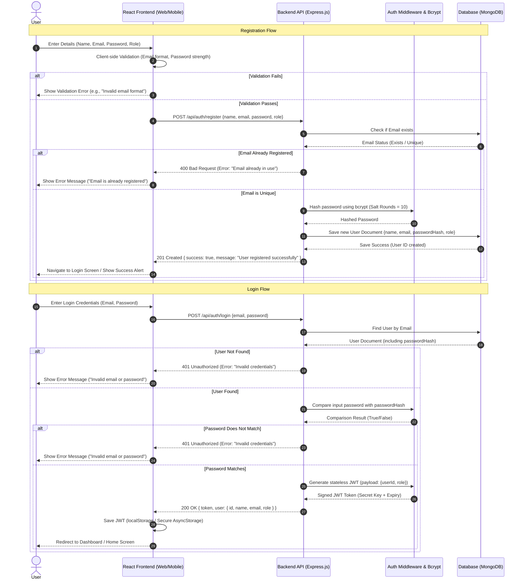
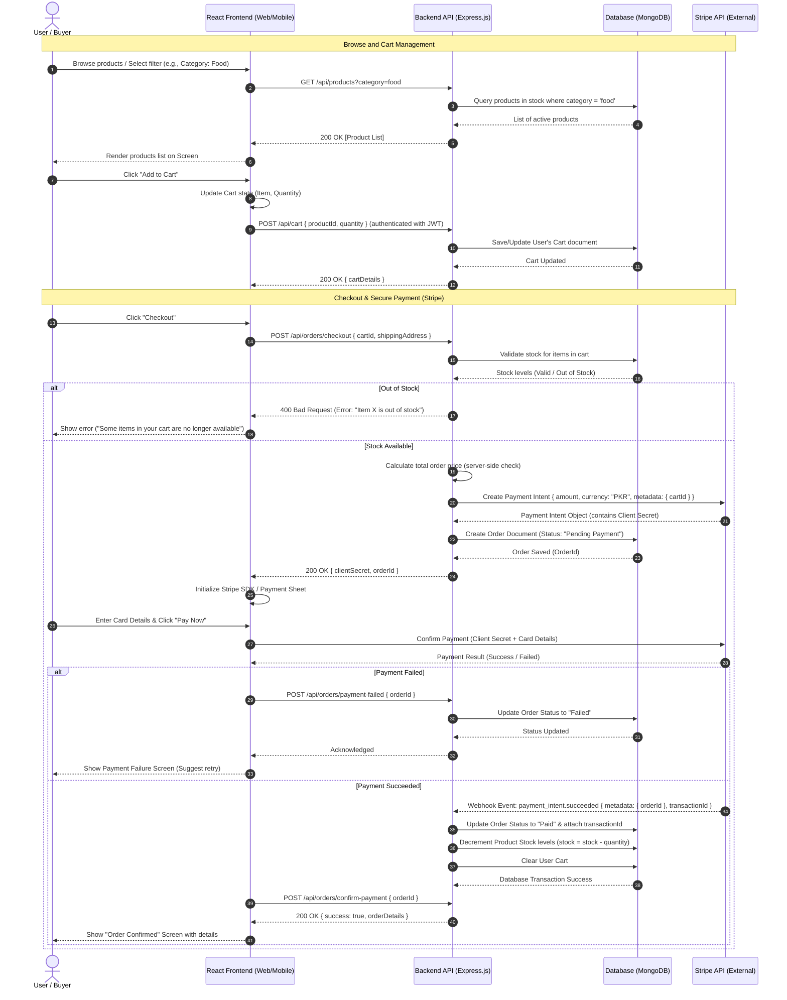
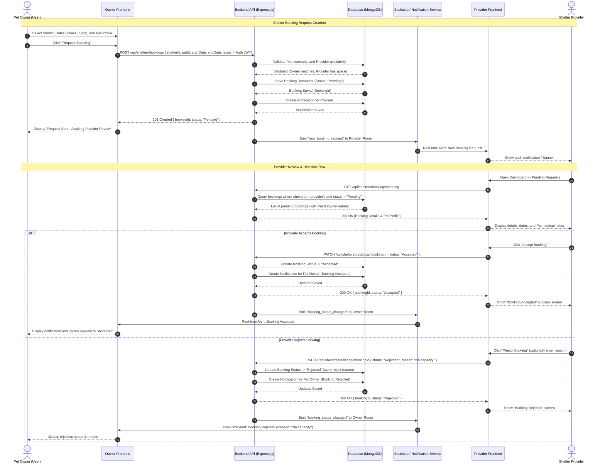
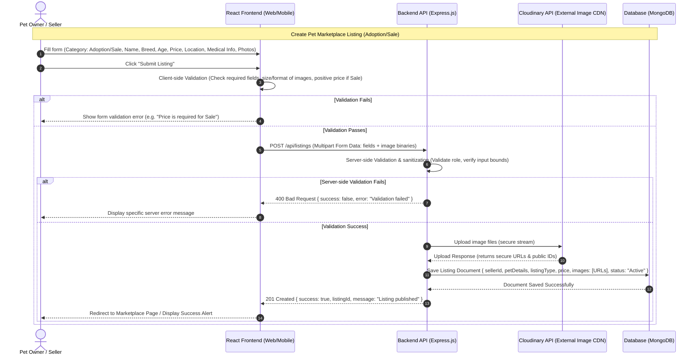
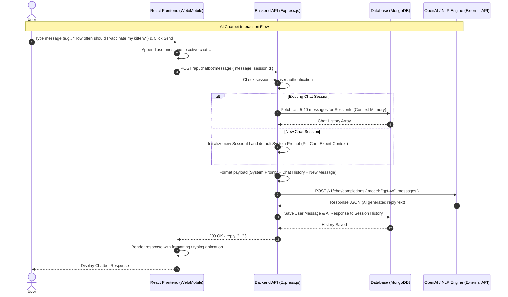
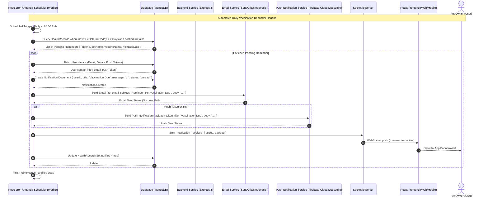
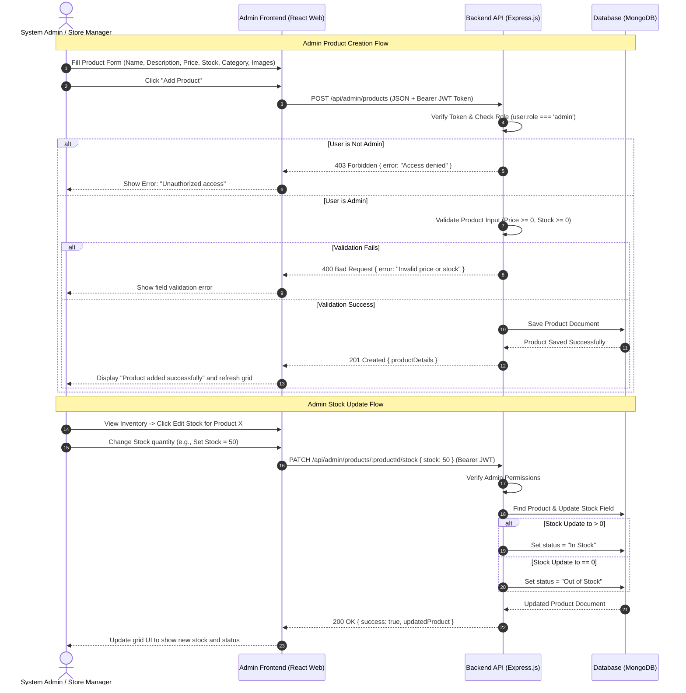
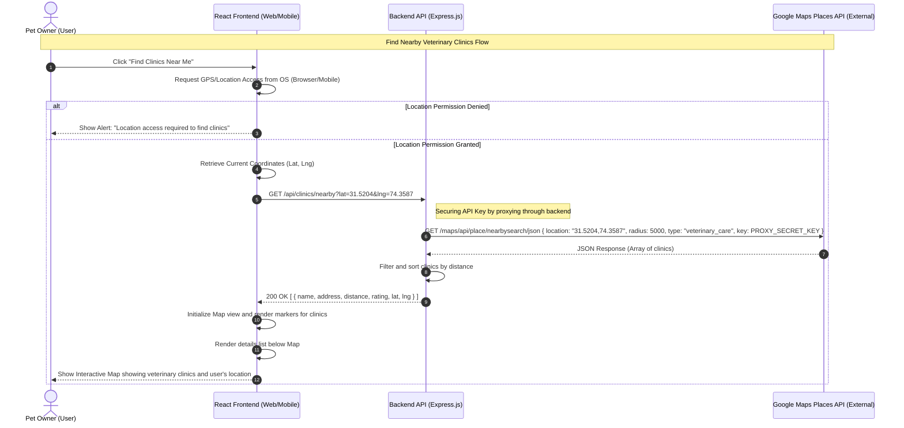
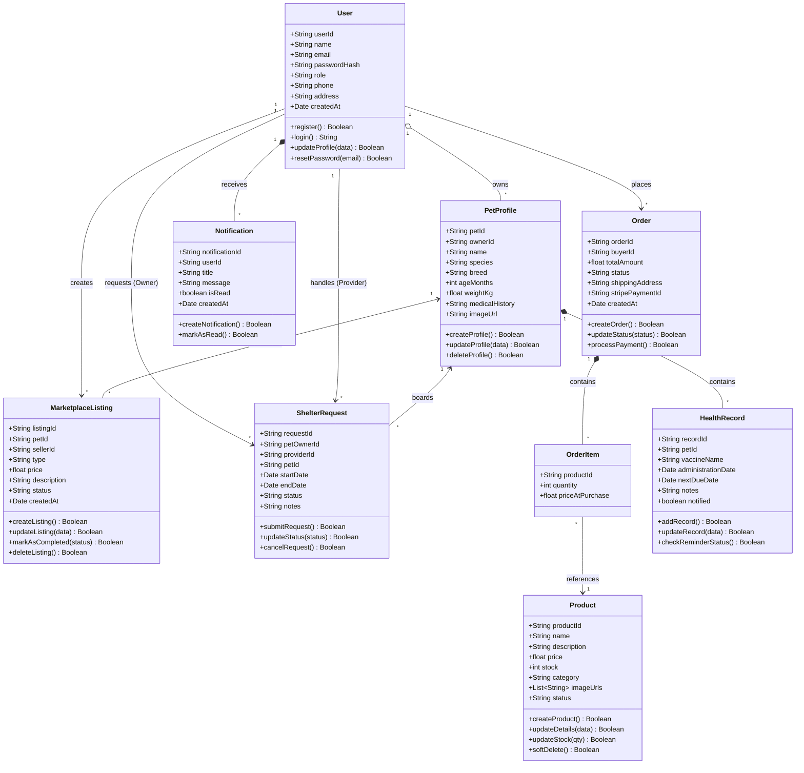
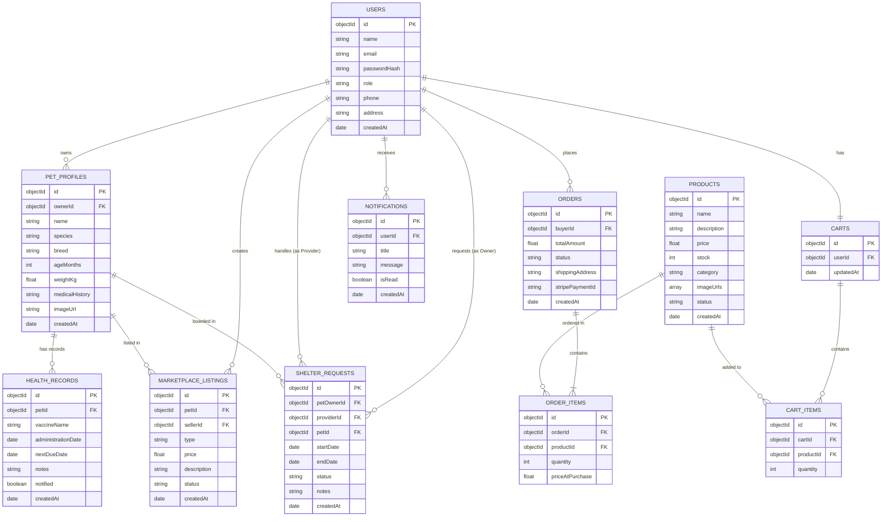

# Agile Software Design Specification
## PetLink
**Product Owner:** Zupash Awais  
**Presented by:** Group ID: S26SE025  

### Team Members
| Member Name | Registration Number | Roles |
| :--- | :--- | :--- |
| Nabeel Ijaz | L1F22BSSE0286 | Backend Development |
| Ehsan Shahid | L1F22BSSE0297 | Mobile App Development |
| Umar Akram | L1S23BSSE0100 | Web Development |
| Usama | L1S23BSSE0089 | Database Design & Testing |

**Faculty of Information Technology & Computer Science**  
**University of Central Punjab**  
**Version 1.0**  

---

## Revision History & Sprint Log

| **Version** | **Sprint** | **Date** | **Changes** | **Owner** |
| :--- | :--- | :--- | :--- | :--- |
| 0.1 | Sprint 1 | 2026-03-10 | Created Architecture and Authentication Module Design | Nabeel Ijaz |
| 0.2 | Sprint 2 | 2026-03-24 | Added Pet Profile and Listing Module diagrams | Umar Akram |
| 0.3 | Sprint 3 | 2026-04-07 | Integrated Shelter Booking and Health scheduler workflows | Ehsan Shahid |
| 0.4 | Sprint 4 | 2026-04-21 | Added Product Management and E-commerce flows | Usama |
| 0.5 | Sprint 5 | 2026-05-05 | Integrated Stripe Payment details & Webhooks | Nabeel Ijaz |
| 0.6 | Sprint 6 | 2026-05-19 | Generated Google Maps & AI Chatbot sequences | Ehsan Shahid |
| 1.0 | Sprint 7 | 2026-06-02 | Completed Database ERD, API schema tables and final review | Group S26SE025 |

---

## Idea Defence & Phase 1 Feedback
*   **Feedback 1:** The platform should prioritize data security when handling commercial marketplace sales.
    *   *Action:* Selected Stripe integration using Server-Side Payment Intents and webhooks to avoid storing sensitive cardholder details on the PetLink servers.
*   **Feedback 2:** The AI chatbot should have clear context limits to prevent hallucinating medical diagnoses.
    *   *Action:* Explicitly designed chatbot to load strict system prompts, directing users to professional veterinary advice, and limiting scope to platform support.

---

## Abstract
PetLink is a cross-platform web and mobile application developed to serve as a comprehensive pet management platform. It provides a centralized digital solution for pet owners, adopters, buyers, and small service providers in Pakistan, enabling them to manage all pet-related activities through a single, user-friendly system. 

In today’s fragmented environment, pet owners face significant challenges when they want to sell or adopt a pet, arrange temporary shelter during travel, purchase pet products, or maintain accurate health records. Most activities are currently handled through scattered social media groups, informal WhatsApp listings, or separate unconnected websites. This leads to incomplete information, lack of trust, difficulty in tracking vaccination schedules, unreliable service coordination, and increased risk of missing important pet care deadlines.

The proposed system offers a complete set of functionalities including user and pet profile management, pet adoption and sale listings with proper validation, temporary shelter service requests, an integrated pet product store with secure payment gateway, digital pet health and vaccination record management with automated reminders, Google Maps-based nearby veterinary clinic locator, and a custom AI-driven chatbot for instant user assistance and guidance. 

By addressing these issues, PetLink fulfills a vital public need in the growing pet ownership community of Pakistan. It improves pet welfare through better record-keeping and timely care, enhances trust and transparency in pet trading and services, reduces fragmentation in the market, and provides a reliable, accessible platform that brings convenience and organization to thousands of pet owners.

---

## 1. System Architecture

### 1.1 High-Level Architecture
PetLink follows a **Layered Client-Server Architecture** utilizing the **MERN (MongoDB, Express.js, React, Node.js) Stack**. This style is chosen for:
1.  **Strict Separation of Concerns:** Decoupling presentation (React.js/React Native) from business rules (Node/Express API) allows independent scaling and simultaneous multi-frontend developments.
2.  **Platform Agnostic Interoperability:** A single backend API services both the React.js web portal (for admins/storefront) and the React Native app (for pet owners/service providers) using standardized JSON payloads.
3.  **NoSQL Scalability:** MongoDB documents map naturally to dynamic object models (User, Pets, Listings) without rigid relational join performance costs.

```mermaid
graph TD
    subgraph Client Layer (Presentation)
        Web["React.js Web App (Storefront/Admin Portal)"]
        Mobile["React Native Mobile App (iOS/Android)"]
    end

    subgraph Communication & Gateway Layer
        HTTP["RESTful HTTP (JSON over HTTPS)"]
        WS["WebSockets (Socket.io)"]
    end

    subgraph Application Service Layer (Logic)
        API["Node.js Express API Gateway"]
        AuthSvc["Authentication Service (JWT/Bcrypt)"]
        StoreSvc["Storefront & Inventory Controller"]
        BoardingSvc["Shelter Booking Controller"]
        HealthSvc["Health vault & Scheduler"]
        ChatbotSvc["AI Agent Service (OpenAI wrapper)"]
    end

    subgraph External Integrations
        Stripe["Stripe Payments API"]
        GoogleMaps["Google Maps Places API"]
        OpenAI["OpenAI NLP API"]
        Nodemailer["SendGrid / NodeMailer Email Service"]
        FCM["Firebase Cloud Messaging (Push Notifications)"]
    end

    subgraph Data Persistence Layer
        DB[("MongoDB Atlas Database Cluster")]
    end

    %% Routing
    Web --> HTTP
    Mobile --> HTTP
    Mobile --> WS

    HTTP --> API
    WS --> API

    API --> AuthSvc
    API --> StoreSvc
    API --> BoardingSvc
    API --> HealthSvc
    API --> ChatbotSvc

    StoreSvc --> Stripe
    BoardingSvc --> FCM
    HealthSvc --> Nodemailer
    HealthSvc --> FCM
    ChatbotSvc --> OpenAI
    API --> GoogleMaps

    AuthSvc --> DB
    StoreSvc --> DB
    BoardingSvc --> DB
    HealthSvc --> DB
    ChatbotSvc --> DB
```

### 1.2 Component Overview
*   **React Frontend (Web):** Provides responsive marketplace interface for buyers and an administrative panel for product management, stock monitoring, and order updates.
*   **React Native Frontend (Mobile):** Cross-platform mobile app managing location services (clinics), real-time push alerts, and direct pet health logging.
*   **Express API Server:** Serves as the primary entry point, implementing routes, request schema validation, controllers, and authorization middlewares.
*   **MongoDB Atlas Cluster:** Cloud storage system holding collections for users, profiles, products, logs, and notification queues.
*   **JWT Security Module:** Sign and verify JSON Web Tokens, establishing stateless user authorization.
*   **OpenAI NLP Adapter:** Connects requests to AI engine for real-time pet care conversations.
*   **Stripe Payment Adapter:** Orchestrates secure checkout tokens and receives Stripe webhook events.
*   **Location service Engine:** Interfaces with Google Places API to proxy coordinate maps safely.

---

## 2. Mapping Design to User Stories

| **Story ID** | **Component** | **Description** | **Persistence Collection** |
| :--- | :--- | :--- | :--- |
| **US-01 / 02** | Authentication Module | Handles registration, validation, login, and token issue | `users` |
| **US-05** | Pet Profile Module | Creates and updates pet statistics, ages, and breeds | `petprofiles` |
| **US-06 / 07** | Marketplace Listing | Creates listings for adoption/sale with validation | `marketplacelistings` |
| **US-09** | Shelter Booking Service | Allows pet owners to request temporary boarding | `shelterrequests` |
| **US-10** | Stripe Payment Module | Processes checkouts and updates transaction logs | `orders` & `orderitems` |
| **US-11 / 12** | Health Scheduler | Manages pet vaccine dates and triggers cron alerts | `healthrecords` |
| **US-13** | AI Chatbot Service | Sends queries to OpenAI and maintains session logs | `chatbotconversations` |
| **US-14** | Google Maps Service | Proxies coordinate-based veterinary search | N/A (External API) |
| **US-17 - 23** | Admin Store Manager | Adds and updates product logs and stock states | `products` |
| **US-30 - 32** | Shopping Cart Module | Tracks current checkout queues | `carts` & `cartitems` |

---

## 3. Detailed System Design

### 3.1 Module Decomposition
1.  **Authentication Module:** Encapsulates the hashing operations (`bcrypt`), validation rules, token generations (`jsonwebtoken`), and JWT-bearer extractors.
2.  **API Routing Layer:** Exposes versioned endpoints (e.g., `/api/v1/...`) and routes traffic to respective module controllers.
3.  **Data Processing & Validation Module:** Implements server-side schema verification via `Joi` or `yup` before executing write/update requests on MongoDB.
4.  **Notification & Worker Engine:** Houses daily automated chron tasks (`node-cron`) to check due vaccination dates and broadcast alerts.
5.  **External Services Wrapper:** Isolates API structures for OpenAI, Stripe, and Google Maps to prevent dependency leakage.

### 3.2 Data Flow Description
*   **Secure Authentication Flow:** User submits credentials $\rightarrow$ Express Router captures payload $\rightarrow$ Validation schema evaluates inputs $\rightarrow$ Controller queries `users` collection $\rightarrow$ Password hash matches $\rightarrow$ Server returns Signed JWT $\rightarrow$ Client saves token in storage for subsequent requests.
*   **E-Commerce Checkout Flow:** User completes payment form $\rightarrow$ Frontend initiates checkout $\rightarrow$ Backend checks `products` inventory $\rightarrow$ Backend requests Stripe Payment Intent $\rightarrow$ Stripe returns `clientSecret` $\rightarrow$ Frontend completes transaction $\rightarrow$ Stripe triggers webhook event $\rightarrow$ Backend decrements stock levels $\rightarrow$ Clears `carts` $\rightarrow$ Emits success notification.

---

## 4. UML Diagrams

### 4.1 Sequence Diagrams

#### 1. User Authentication


#### 2. Pet Marketplace Purchase (Stripe Integration)


#### 3. Shelter Service Request


#### 4. Create Listing (Adoption/Sale)


#### 5. AI Chatbot Interaction


#### 6. Vaccination Reminder


#### 7. Admin Product Management


#### 8. Find Nearby Clinics


---

### 4.2 Class Diagram


---

## 5. Database Design (ERD)

### 5.1 ER Diagram


### 5.2 Schema Tables

#### 1. Users Collection
| Field Name | Data Type | Key/Index | Required? | Constraints & Details |
| :--- | :--- | :--- | :--- | :--- |
| `_id` | ObjectId | PK | Yes | Auto-generated by MongoDB |
| `name` | String | | Yes | Length: 3 - 50 characters |
| `email` | String | Unique | Yes | Valid email format, indexed |
| `passwordHash` | String | | Yes | Hashed via bcrypt |
| `role` | String | | Yes | Enum: `['admin', 'buyer', 'seller', 'shelter_provider']` |
| `phone` | String | | No | Format check for Pakistani numbers |
| `address` | String | | No | Physical location |
| `createdAt` | Date | | Yes | Defaults to `Date.now()` |

#### 2. PetProfiles Collection
| Field Name | Data Type | Key/Index | Required? | Constraints & Details |
| :--- | :--- | :--- | :--- | :--- |
| `_id` | ObjectId | PK | Yes | Auto-generated |
| `ownerId` | ObjectId | FK, Index | Yes | References `Users._id` |
| `name` | String | | Yes | Name of pet |
| `species` | String | | Yes | e.g. `'Cat'`, `'Dog'`, `'Bird'` |
| `breed` | String | | Yes | e.g. `'Siamese'`, `'Persian'` |
| `ageMonths` | Number | | Yes | Integer >= 0 |
| `weightKg` | Number | | Yes | Float value > 0 |
| `medicalHistory` | String | | No | Free-text field for historical conditions |
| `imageUrl` | String | | Yes | Cloudinary storage link |

#### 3. MarketplaceListings Collection
| Field Name | Data Type | Key/Index | Required? | Constraints & Details |
| :--- | :--- | :--- | :--- | :--- |
| `_id` | ObjectId | PK | Yes | Auto-generated |
| `petId` | ObjectId | FK, Index | Yes | References `PetProfiles._id` |
| `sellerId` | ObjectId | FK, Index | Yes | References `Users._id` |
| `type` | String | | Yes | Enum: `['adoption', 'sale']` |
| `price` | Number | | Yes | Must be >= 0 (Must be 0 if type is `'adoption'`) |
| `description` | String | | Yes | Max 1000 characters |
| `status` | String | | Yes | Enum: `['active', 'sold', 'adopted', 'inactive']` |
| `createdAt` | Date | | Yes | Defaults to `Date.now()` |

#### 4. ShelterRequests Collection
| Field Name | Data Type | Key/Index | Required? | Constraints & Details |
| :--- | :--- | :--- | :--- | :--- |
| `_id` | ObjectId | PK | Yes | Auto-generated |
| `petOwnerId` | ObjectId | FK, Index | Yes | References `Users._id` (Pet Owner) |
| `providerId` | ObjectId | FK, Index | Yes | References `Users._id` (Shelter Provider) |
| `petId` | ObjectId | FK | Yes | References `PetProfiles._id` |
| `startDate` | Date | | Yes | Boarding start date |
| `endDate` | Date | | Yes | Boarding end date, must be >= `startDate` |
| `status` | String | | Yes | Enum: `['pending', 'accepted', 'rejected', 'cancelled']` |
| `notes` | String | | No | Special care requirements |

#### 5. Products Collection
| Field Name | Data Type | Key/Index | Required? | Constraints & Details |
| :--- | :--- | :--- | :--- | :--- |
| `_id` | ObjectId | PK | Yes | Auto-generated |
| `name` | String | | Yes | Product name |
| `description` | String | | Yes | Details |
| `price` | Number | | Yes | Must be >= 0 |
| `stock` | Number | | Yes | Must be integer >= 0 |
| `category` | String | | Yes | Enum: `['food', 'medicine', 'accessories', 'toys']` |
| `imageUrls` | Array (String) | | Yes | Array of CDN links |
| `status` | String | | Yes | Enum: `['in_stock', 'out_of_stock']` |

#### 6. Orders Collection
| Field Name | Data Type | Key/Index | Required? | Constraints & Details |
| :--- | :--- | :--- | :--- | :--- |
| `_id` | ObjectId | PK | Yes | Auto-generated |
| `buyerId` | ObjectId | FK, Index | Yes | References `Users._id` |
| `totalAmount` | Number | | Yes | Total purchase cost |
| `status` | String | | Yes | Enum: `['pending', 'paid', 'shipped', 'delivered', 'cancelled']` |
| `shippingAddress` | String | | Yes | Delivery location |
| `stripePaymentId` | String | Unique | No | Reference to Stripe payment intent id |

#### 7. OrderItems Collection
| Field Name | Data Type | Key/Index | Required? | Constraints & Details |
| :--- | :--- | :--- | :--- | :--- |
| `_id` | ObjectId | PK | Yes | Auto-generated |
| `orderId` | ObjectId | FK, Index | Yes | References `Orders._id` |
| `productId` | ObjectId | FK | Yes | References `Products._id` |
| `quantity` | Number | | Yes | Integer >= 1 |
| `priceAtPurchase` | Number | | Yes | Remembers price at time of sale |

#### 8. HealthRecords Collection
| Field Name | Data Type | Key/Index | Required? | Constraints & Details |
| :--- | :--- | :--- | :--- | :--- |
| `_id` | ObjectId | PK | Yes | Auto-generated |
| `petId` | ObjectId | FK, Index | Yes | References `PetProfiles._id` |
| `vaccineName` | String | | Yes | e.g. `'Rabies'` |
| `administrationDate`| Date | | Yes | Date given |
| `nextDueDate` | Date | Index | Yes | Next scheduled vaccination |
| `notes` | String | | No | General comments |
| `notified` | Boolean | | Yes | Default: `false` |

#### 9. Notifications Collection
| Field Name | Data Type | Key/Index | Required? | Constraints & Details |
| :--- | :--- | :--- | :--- | :--- |
| `_id` | ObjectId | PK | Yes | Auto-generated |
| `userId` | ObjectId | FK, Index | Yes | References `Users._id` |
| `title` | String | | Yes | Title text |
| `message` | String | | Yes | Detailed body text |
| `isRead` | Boolean | | Yes | Default: `false` |

#### 10. Carts & CartItems Collections

**Carts Table**
| Field Name | Data Type | Key/Index | Required? | Constraints & Details |
| :--- | :--- | :--- | :--- | :--- |
| `_id` | ObjectId | PK | Yes | Auto-generated |
| `userId` | ObjectId | FK, Index | Yes | References `Users._id` (One active cart per user) |
| `updatedAt` | Date | | Yes | Last modified time |

**CartItems Table**
| Field Name | Data Type | Key/Index | Required? | Constraints & Details |
| :--- | :--- | :--- | :--- | :--- |
| `_id` | ObjectId | PK | Yes | Auto-generated |
| `cartId` | ObjectId | FK, Index | Yes | References `Carts._id` |
| `productId` | ObjectId | FK | Yes | References `Products._id` |
| `quantity` | Number | | Yes | Integer >= 1 |

---

## 6. API Design

The following table documents the REST endpoint contracts between client applications (React/React Native) and the Express backend. All protected endpoints expect a `Bearer <JWT_TOKEN>` header.

| Endpoint | Method | Input (JSON/Params) | Output (JSON on success) | Description |
| :--- | :--- | :--- | :--- | :--- |
| `/api/auth/register` | `POST` | `{name, email, password, role}` | `{success, token, user}` | Registers user |
| `/api/auth/login` | `POST` | `{email, password}` | `{success, token, user}` | Logs in user |
| `/api/pets` | `POST` | `{name, species, breed, ageMonths, weightKg, imageUrl}` | `{success, petProfile}` | Creates pet profile (Auth) |
| `/api/pets` | `GET` | None | `[petProfiles]` | Gets authenticated user's pets |
| `/api/listings` | `POST` | Multipart Form Data | `{success, listingId}` | Publishes adoption/sale listing (Auth) |
| `/api/listings` | `GET` | query: `?type=sale&category=cat` | `[listings]` | Gets filtered listings |
| `/api/shelters/bookings`| `POST` | `{shelterId, petId, startDate, endDate, notes}` | `{success, booking}` | Requests boarding booking (Auth) |
| `/api/shelters/bookings/:bookingId` | `PATCH` | `{status: 'Accepted'/'Rejected'}` | `{success, booking}` | Updates booking status (Auth) |
| `/api/products` | `GET` | query: `?category=food&search=kitty` | `[products]` | Retrieves products for store |
| `/api/admin/products` | `POST` | `{name, description, price, stock, category, imageUrls}` | `{success, product}` | Adds new product (Admin Auth) |
| `/api/orders/checkout` | `POST` | `{cartId, shippingAddress}` | `{clientSecret, orderId}` | Prepares Stripe transaction (Auth) |
| `/api/orders/confirm-payment`| `POST` | `{orderId}` | `{success, order}` | Confirms Stripe payment success (Auth) |
| `/api/chatbot/message` | `POST` | `{message, sessionId}` | `{reply}` | Submits message to AI Chatbot (Auth) |
| `/api/clinics/nearby` | `GET` | query: `?lat=31.5204&lng=74.3587` | `[clinics]` | Proxies Google Maps Places API |

---

## 7. UI/UX Design (Prototypes)

### 7.1 Navigation Flow
```
[Splash Screen] ──> [Welcome / Onboarding]
                           │
             ┌─────────────┴─────────────┐
             ▼                           ▼
      [Login Screen]             [Register Screen]
             │ (JWT saved)
             ▼
     [Main Shell (Tab Bar)]
      ├── Home Dashboard (AI Quick Assist, Next Vaccinations, Map Shortcut)
      ├── Marketplace Tab (Listings feed, Search, Filters, Add Listing Form)
      ├── Shop Tab (Product catalog, Categories, Shopping Cart icon ──> Checkout Screen)
      └── Health Tab (Pet records list, Vaccine log, Add Medical Record Form)
```

### 7.2 Core Screen Wireframes

#### Home Dashboard Shell
```
+--------------------------------------------------------+
|  [PetLink Logo]                       [Cart Icon (3)]  |
+--------------------------------------------------------+
|  Hello, Nabeel!                                        |
|  [Upcoming Notification: Fluffy's Rabies vaccine due]  |
+--------------------------------------------------------+
|  QUICK ACCESS ACTIONS                                  |
|  [AI Assistant]   [Find Clinic]   [Shelter Bookings]   |
+--------------------------------------------------------+
|  MY PETS                                               |
|  +-------------------+  +-------------------+          |
|  | Fluffy (Cat)      |  | Bruno (Dog)       |          |
|  | Age: 12 months    |  | Age: 4 months     |          |
|  +-------------------+  +-------------------+          |
+--------------------------------------------------------+
|  Home        Marketplace        PetShop        Profile |
+--------------------------------------------------------+
```

#### E-Commerce Checkout Screen
```
+--------------------------------------------------------+
|  < Back to Cart             CHECKOUT                   |
+--------------------------------------------------------+
|  ORDER SUMMARY                                         |
|  1x Royal Canin Kitten Food 2kg        Rs. 4,500       |
|  2x Cat Toy Mice                       Rs.   800       |
|  Delivery Fee                          Rs.   200       |
|  ----------------------------------------------------  |
|  TOTAL AMOUNT                          Rs. 5,500       |
+--------------------------------------------------------+
|  SHIPPING ADDRESS                                      |
|  [ Johar Town, Phase 2, Block R1, Lahore, Pakistan   ] |
+--------------------------------------------------------+
|  PAYMENT DETAILS (Secured by Stripe)                   |
|  Card Number:    [ XXXX XXXX XXXX XXXX ]               |
|  Expiry / CVV:   [ MM/YY ]   [ CVC ]                   |
+--------------------------------------------------------+
|                      [ PAY NOW ]                       |
+--------------------------------------------------------+
```

---

## 8. Sprint-wise Design Evolution

| **Sprint** | **Features Designed** | **Design Improvements / Evolution** |
| :--- | :--- | :--- |
| **Sprint 1** | Authentication & Profiles | Initially planned cookie-based session state. Migrated to stateless JSON Web Tokens (JWT) saved in Secure Store to unify Web and Mobile clients. |
| **Sprint 2** | Marketplace & Lists | Added MongoDB Compound indexes on `{ breed: 1, type: 1 }` to handle high-frequency searches. |
| **Sprint 3** | Shelter & Health Logging | Added checking of `nextDueDate` inside the schema to trigger auto-notified field updates. |
| **Sprint 4** | E-commerce Backend | Modeled `OrderItems` as a separate table to log price locks at the timestamp of checkout. |
| **Sprint 5** | Checkout & Stripe Payment | Implemented Stripe Webhook listener on `/api/webhooks/stripe`. Prevents client-side network interruptions from canceling orders. |
| **Sprint 6** | AI Agent & Location Map | Configured backend server proxy for Google Places API search to keep the developer API secret key hidden from client bundles. |
| **Sprint 7** | Notification System | Formulated notification fallback: WebSocket trigger first $\rightarrow$ check if client active $\rightarrow$ Firebase push notifications. |
| **Sprint 8** | Integration & Final QA | Normalized database tables and optimized query payloads for mobile networks. |

---

## 9. Test Design

| **Test ID** | **Scenario Description** | **Input Data** | **Expected Result** |
| :--- | :--- | :--- | :--- |
| **TC-AUTH-01**| Login with incorrect password | Email: `nabeel@gmail.com`, Pass: `wrong123` | Server yields `401 Unauthorized` with "Invalid email or password" error. |
| **TC-MARK-02**| Create listing with invalid parameters | Listing price: `-500` | Frontend validator catches error, prevents form submission. |
| **TC-SHOP-03**| Purchase product when stock is empty | Product: `Dog Leash`, Requested Qty: `5` (Stock: `2`)| API yields `400 Bad Request` with "Item out of stock" message. |
| **TC-STRIP-04**| Secure webhook callback validation | Event: `payment_intent.succeeded` | Backend matches metadata `orderId`, updates status, and decrements stock. |
| **TC-CHAT-05**| Chat bot empty message payload | Query: `""` | Validator returns empty input error, chatbot api is not invoked. |
| **TC-MAP-06** | Find clinics when GPS coordinates block | Latitude: `null`, Longitude: `null` | Frontend catches location permission rejection, displays placeholder alert. |

---

## 10. Design Quality Attributes

### 10.1 Security
1.  **Transport Security:** HTTPS/TLS 1.3 encryption is enforced on all API routes.
2.  **Sensitive Data Storage:** Passwords are encoded using `bcrypt` with a work factor of 10. Card numbers are processed directly on Stripe's PCI-DSS compliant terminals, meaning no raw financial details hit PetLink servers.
3.  **Cross-Origin Protections:** Standard CORS constraints restrict backend calls to authenticated clients. Server-side inputs are filtered to avoid NoSQL injection.

### 10.2 Scalability
1.  **Stateless API Design:** Because the server session is stateless (via JWT), the Node.js API process can easily scale horizontally across load balancers (e.g. AWS Application Load Balancer).
2.  **Caching Strategy:** Google Map Places queries are cached on the server for 6 hours since clinic locations change rarely.
3.  **Indexing:** MongoDB compound indexes are added to fields that are searched frequently (like `nextDueDate`, `role`, and `status`).

### 10.3 Maintainability
1.  **Folder Architecture:** Modules are separated into `/models`, `/controllers`, `/routes`, and `/middleware`.
2.  **API Versioning:** Version tags in paths (e.g., `/api/v1`) allow backend updates without breaking older installations.

---

## 11. Deployment Considerations

*   **Frontend Web Hosting:** React.js dashboard is hosted on **Vercel** for fast asset delivery.
*   **Mobile App distribution:** React Native outputs build bundles to Google Play Store and Apple App Store.
*   **Backend Server:** Node.js server runs in a Docker container hosted on **Render** (or AWS ECS).
*   **Database persistence:** MongoDB Atlas manages backups, automated replica updates, and scaling.
*   **Version Control:** GitHub with a branch framework:
    *   `main`: Holds production code.
    *   `develop`: The target branch for sprint integration tests.
    *   `feature/*`: Temporary branches where developers code individual backlog tasks.

---

## 12. Future Enhancements
1.  **AI Smart Pet Match:** Recommendation engine to connect prospective adopters with pets.
2.  **Offline Record Cache:** Local storage syncing for health logs during cellular blackouts.
3.  **Video Vet Consultations:** Dynamic video consulting linking vet clinics directly to user devices.

---

## 13. References
*   Sommerville, I. (2016). *Software Engineering* (10th ed.). Pearson.
*   React.js Foundation. (2025). *React Documentation*. Retrieved from https://react.dev
*   MongoDB Inc. (2025). *MongoDB Atlas Manual*. Retrieved from https://www.mongodb.com/docs
*   Stripe. (2025). *Stripe API Docs*. Retrieved from https://stripe.com/docs/api

---

## Appendix A: Glossary
*   **MERN:** MongoDB, Express.js, React.js, Node.js development architecture stack.
*   **JWT:** JSON Web Token for stateless user authentication.
*   **FCM:** Firebase Cloud Messaging push notification hub.
*   **Bcrypt:** Password hashing algorithm.
*   **PCI-DSS:** Payment Card Industry Data Security Standard.

---

## Appendix B: IV & V Report

**Verification Officer:** Usama (Database and QA Specialist)

| **S#** | **Defect Description** | **Origin Stage** | **Status** | **Fix Time (Mins)** |
| :--- | :--- | :--- | :--- | :--- |
| 1 | API Schema did not validate negative pricing inputs | Database | Fixed | 25 |
| 2 | Token verification module lacked expiry boundaries | Security | Fixed | 40 |
| 3 | Image upload streams to Cloudinary locked CPU event loop | Performance | Fixed | 90 |
| 4 | Map locator key leaked in frontend mobile bundles | Security | Fixed | 120 |
| 5 | Double click on Stripe checkout generated duplicates | Transaction | Fixed | 60 |
