# BSSE FINAL PROJECT
## Agile Software Design Specification
**PetLink – Centralized Pet Management Platform**

**Product Owner:** Zupash Awais  
**Presented by Group ID:** S26SE025  

| **Member Name** | **Reg# No** |
| ------ | ------ |
| Nabeel Ijaz | L1F22BSSE0286 |
| Ehsan Shahid | L1F22BSSE0297 |
| Umar Akram | L1S23BSSE0100 |
| Usama | L1S23BSSE0089 |

**Faculty of Information Technology & Computer Science**  
**University of Central Punjab**  
Agile Software Design Specification  
SDS Phase II  
**Version:** Version 2  

**Product Owner:** Zupash Awais  
**Scrum Master:** Nabeel Ijaz  
**Group:** S26SE025  

**Team**  
| **Member Name** | **Roles** |
| ------ | ------ |
| Nabeel Ijaz | Scrum Master + Backend Development |
| Umar Akram | Frontend Web Development + UI/UX |
| Usama | Database Design and Testing |
| Ehsan Shahid | Mobile App Development |

### Table of Contents
*   **Table of Contents** i
*   **Revision History & Sprint Log** ii
*   **Previous Phases Feedback** ii
*   **Abstract** iii
*   **1. System Architecture** 1
*   1.1 High-Level Architecture 1
*   1.2 Architecture Diagram 1
*   1.3 Component Overview 1
*   **2. Mapping Design to User Stories** 2
*   **3. Detailed System Design** 3
*   3.1 Module Decomposition 3
*   3.2 Data Flow Description 3
*   **4. UML Diagrams** 4
*   4.1 Sequence Diagrams 4
*   4.2 Class Diagram 4
*   **5. Database Design (ERD)** 5
*   5.1 ER Diagram 5
*   5.2 Schema Tables 5
*   **6. API Design** 6
*   **7. UI/UX Design (Prototypes)** 7
*   **8. Sprint-wise Design Evolution** 8
*   **9. Test Design** 9
*   **10. Design Quality Attributes** 10
*   **11. Deployment Considerations** 11
*   **12. Future Enhancements** 12
*   **13. Revised Project Plan** 13
*   **14. References** 14
*   **Appendix A: Glossary** 15
*   **Appendix B: IV & V Report** 16

---

### Revision History & Sprint Log
| **Version** | **Sprint** | **Date** | **Changes** | **Owner** |
| ------ | ------ | ------ | ------ | ------ |
| 1.0 | Sprint 7 | 2026-06-02 | Initial Phase II Architecture and Schema Design drafts | Nabeel Ijaz |
| 2.0 | Sprint 8 | 2026-06-04 | Completed full document restructuring matching UCP SDP standards | Group S26SE025 |

### Previous Phases Feedback
*   **Feedback 1:** The platform should prioritize data security when handling commercial marketplace sales.
    *   *Action:* Selected Stripe integration using Server-Side Payment Intents and webhooks to avoid storing sensitive cardholder details on the PetLink servers.
*   **Feedback 2:** The AI chatbot should have clear context limits to prevent hallucinating medical diagnoses.
    *   *Action:* Explicitly designed chatbot to load strict system prompts, directing users to professional veterinary advice, and limiting scope to platform support.

### Abstract
PetLink is a centralized, cross-platform pet management web and mobile application developed to resolve the safety, transaction, and organization challenges faced by Pakistani pet owners, adopters, buyers, and service providers. In Pakistan, pet ownership services are largely unorganized. Owners struggle to find verified pets for sale, secure trusted boarding shelters while traveling, maintain structured vaccination histories, and discover emergency veterinary help. Most activities are currently scattered across unverified Facebook groups, informal WhatsApp chats, or separate offline paper records. This lack of a unified digital structure leads to fraudulent trades, missed vaccine due dates, and unsafe boarding facilities. PetLink aims to transform this informal system into a secure, intelligent, and technology-driven pet care ecosystem.

The system provides multiple features designed to improve pet management efficiency and transaction transparency. Pet owners can build comprehensive digital profiles for their pets, list them for adoption or sale, request temporary boarding services from verified local providers, track medical and vaccination history with automatic reminders, and search for nearby veterinary clinics. To establish a secure environment, payments are handled using the Stripe API gateway, clinic lookups run through the Google Maps API, and a custom AI-driven chatbot offers instant 24/7 care support.

PetLink is developed using a modern MERN stack. React.js powers the administrative storefront portal, React Native handles the client-side iOS and Android mobile applications, Node.js and Express.js handle backend logic, and MongoDB manages cloud storage. Additional integrations like Google Maps API, Stripe SDK, Firebase Cloud Messaging, and OpenAI NLP services ensure location tracking, secure transactions, push notifications, and intelligent conversation assistance. The final system is designed to reduce market fragmentation, secure pet trading, and offer Pakistan's growing pet community a safer, faster, and unified management platform.

---

### 1. System Architecture

#### 1.1 High-Level Architecture
PetLink follows a **3-Tier Layered Client-Server Architecture** integrated with external services. The system is separated into three distinct logical layers:
1.  **Presentation Tier (Client Side):** React Native mobile application for end-users (pet owners, adopters, shelter providers) and React.js web application for platform administrators and storefront managers.
2.  **Application Logic Tier (Application Server):** A Node.js and Express.js backend server that handles API requests, enforces authentication, runs cron jobs for notifications, coordinates payment verification, and connects with AI/NLP modules.
3.  **Data Tier (Database Server):** A MongoDB database cluster managed via MongoDB Atlas, storing persistent records for users, pet profiles, marketplace listings, bookings, orders, and health histories.

This **3-Tier architecture** is chosen because it separates presentation, logic, and data. This separation allows developers to update UI designs without modifying backend code or database schemas. It supports independent scaling of client connections, allows secure authentication validation server-side (protecting keys and data), and provides platform-independent access where the same backend services can support both web and mobile platforms.

```mermaid
graph TD
    subgraph Presentation Tier (Client Web & Mobile)
        Web["React.js Web App (Storefront/Admin Portal)"]
        Mobile["React Native Mobile App (iOS/Android)"]
    end

    subgraph Application Logic Tier (API & Controller Server)
        API["Node.js Express API Gateway"]
        AuthSvc["Authentication Module (JWT/Bcrypt)"]
        StoreSvc["Storefront & Inventory Controller"]
        BoardingSvc["Shelter Booking Controller"]
        HealthSvc["Health vault & Scheduler"]
        ChatbotSvc["AI Agent Service (OpenAI wrapper)"]
    end

    subgraph External Integrations (Service Layer)
        Stripe["Stripe Payments API"]
        GoogleMaps["Google Maps Places API"]
        OpenAI["OpenAI NLP API"]
        Nodemailer["SendGrid / NodeMailer Email Service"]
        FCM["Firebase Cloud Messaging (Push Notifications)"]
    end

    subgraph Data Tier (Database Storage)
        DB[("MongoDB Atlas Database Cluster")]
    end

    %% Connections
    Web --> API
    Mobile --> API

    API --> AuthSvc
    API --> StoreSvc
    API --> BoardingSvc
    API --> HealthSvc
    API --> ChatbotSvc

    StoreSvc --> Stripe
    BoardingSvc --> FCM
    HealthSvc --> Nodemailer
    HealthSvc --> FCM
    ChatbotSvc --> OpenAI
    API --> GoogleMaps

    AuthSvc --> DB
    StoreSvc --> DB
    BoardingSvc --> DB
    HealthSvc --> DB
    ChatbotSvc --> DB
```

#### 1.3 Component Overview
| **Component** | **Description** |
| ------ | ------ |
| Pet Owner Interface | Allows owners to register, create pet profiles, add health records, request shelters, and purchase products via mobile. |
| Adopter / Buyer Interface | Enables users to browse pet adoption/sale listings, search products, add to cart, and checkout. |
| Admin Dashboard | Web interface for system admins to manage inventory, update product listings, view sales reports, and track orders. |
| Authentication Module | Handles registration, secure login with JWT, bcrypt hashing, and password resets. |
| Pet Profile Module | Creates, updates, and deletes pet details (breed, age, weight, and history). |
| Marketplace Listing Module | Manages listings for adoption/sale with price validations and status updates. |
| Shelter Booking Module | Processes temporary boarding requests and coordinates status changes between owners and providers. |
| E-Commerce Module | Manages the storefront, category filters, cart selections, and inventory balances. |
| Payment Gateway (Stripe) | Connects to Stripe to process payments and verify transactions via webhooks. |
| Location Module (Google Maps) | Handles GPS coordinate lookup to show veterinary clinics near the user. |
| AI Chatbot Module (OpenAI) | Processes natural language user queries and returns instant pet care guidance. |
| Health Scheduler Module | Node-cron worker that checks upcoming vaccine dates and triggers email/push alerts. |
| Notification Module | Distributes push notifications via FCM and emails via Nodemailer. |
| MongoDB Database | Stores user details, profiles, listings, bookings, transactions, and chat records. |

---

## 2. Mapping Design to User Stories

| **Story ID** | **Component** | **Description** |
| ------ | ------ | ------ |
| US-01 | Authentication Module | Allows new users to register an account using email, password, name, and role. |
| US-02 | Authentication Module | Authenticates users and returns signed JWT credentials. |
| US-05 | Pet Profile Module | Creates detailed pet profiles (name, species, breed, age, weight, history). |
| US-06 | Marketplace Module | Creates pet adoption listings and makes them visible in the feed. |
| US-07 | Marketplace Module | Creates pet sale listings with validated prices. |
| US-08 | Marketplace Module | Enables search and filter functions by category, species, breed, and location. |
| US-09 | Shelter Booking Module | Submits a boarding request to a selected shelter provider. |
| US-10 | Payment Module | Integrates Stripe to process checkout payments. |
| US-11 | Health Scheduler Module | Logs vaccination and health events with automatic next due date calculations. |
| US-12 | Health Scheduler Module | Runs background cron jobs to check due dates and send reminders. |
| US-13 | AI Chatbot Module | Connects chatbot interface with OpenAI NLP engine to resolve FAQs. |
| US-14 | Location Module | Displays nearby veterinary clinics on a map layout using GPS services. |
| US-15 | Notification Module | Distributes alerts (e.g., booking status updates, checkout success) in real time. |

---

## 3. Detailed System Design

### 3.1 Module Decomposition

**Authentication Module**
Purpose: Handles secure registration, login, JWT token management, and profile changes.

| **Sub-Modules** | **Description** |
| ------ | ------ |
| Registration System | Validates input details and creates new user records with bcrypt-hashed passwords. |
| Login System | Verifies credentials, generates signed JWTs, and logs users in. |
| JWT Verification | Decodes incoming token headers to authorize secure operations. |
| Profile Manager | Handles modifications to user names, phone numbers, and addresses. |

**Pet Profile Module**
Purpose: Handles CRUD operations for pet statistics and health profiles.

| **Sub-Modules** | **Description** |
| ------ | ------ |
| Profile Creator | Saves new pet records including name, species, breed, age, weight, and image links. |
| Profile Editor | Updates profile values when weight, age, or medical details change. |
| Profile Remover | Removes pet profiles from the active view. |

**Marketplace Module**
Purpose: Coordinates pet adoption and sale listings.

| **Sub-Modules** | **Description** |
| ------ | ------ |
| Listing Creator | Validates prices, matches listings to pet profiles, and creates marketplace records. |
| Feed Viewer | Fetches listings and sorts them by date and type. |
| Search Filter | Performs query operations based on breed, species, location, and price. |
| Listing Status Manager | Marks listings as sold, adopted, or inactive. |

**Shelter Booking Module**
Purpose: Coordinates boarding bookings between owners and providers.

| **Sub-Modules** | **Description** |
| ------ | ------ |
| Booking Creator | Creates booking requests with start/end dates, pet profiles, and notes. |
| Provider Panel | Shows pending, active, and completed booking requests to providers. |
| Status Manager | Lets providers accept or reject bookings, which updates database state. |

**E-Commerce Module**
Purpose: Handles store operations, cart updates, and inventory tracking.

| **Sub-Modules** | **Description** |
| ------ | ------ |
| Storefront Catalog | Shows product categories, names, prices, and images. |
| Cart Manager | Handles additions, removals, and quantity changes in the cart. |
| Inventory Manager | Tracks product stock levels and updates availability flags. |

**Payment Processing Module**
Purpose: Manages checkout transactions and Stripe integrations.

| **Sub-Modules** | **Description** |
| ------ | ------ |
| Price Calculator | Computes the total cost (items + delivery) server-side. |
| Stripe Intent Handler | Requests payment intents from Stripe and returns client secrets to the client. |
| Webhook Monitor | Listens for Stripe payment success notifications to update order records. |

**Health Vault & Scheduler**
Purpose: Manages pet health histories and schedules vaccination reminders.

| **Sub-Modules** | **Description** |
| ------ | ------ |
| Record logger | Logs vaccine names, dates, and calculated next due dates. |
| Daily cron worker | Checks database records daily to find upcoming vaccine due dates. |
| Reminder triggers | Sends push notifications and email alerts when vaccine due dates approach. |

**AI Chatbot Module**
Purpose: Provides natural language response support.

| **Sub-Modules** | **Description** |
| ------ | ------ |
| Chat Interface | Renders conversation messages in a chat interface. |
| Session Handler | Restores recent messages to maintain context. |
| NLP Wrapper | Sends structured system prompts and user queries to OpenAI's API. |

**Location Module**
Purpose: Locates nearby veterinary clinics.

| **Sub-Modules** | **Description** |
| ------ | ------ |
| GPS Coordinate Tracker | Retrieves current device coordinates. |
| API Proxy | Safe backend proxy that queries Google Places API using secret keys. |
| Map Pin Renderer | Plots nearby veterinary clinics on the map view. |

**Notification Module**
Purpose: Manages push, web socket, and email alerts.

| **Sub-Modules** | **Description** |
| ------ | ------ |
| FCM Integrator | Sends push notifications to mobile devices. |
| Mail Sender | Sends HTML-formatted emails via SMTP. |
| Web Socket Service | Sends real-time alerts to active frontend sessions. |

**Data Processing Module**
Purpose: Handles database read and write tasks.

| **Sub-Modules** | **Description** |
| ------ | ------ |
| Schema Validator | Validates model data formats using Mongoose templates. |
| DB Connector | Maintains connection pools to the cloud database. |

**API Layer**
Purpose: Manages integrations with external services.

| **Sub-Modules** | **Description** |
| ------ | ------ |
| Third-Party Handshakes | Coordinates API requests to Stripe, Google Maps, and OpenAI. |

---

### 3.2 Data Flow Description
This section illustrates the transmission, processing, and storage of data across PetLink. It shows the inputs, outputs, and storage locations for user actions, marketplace activities, and external integrations.

#### 1. Data Flow Diagram Level 0 (Context Diagram)
The Context Diagram (Level 0 DFD) represents the overall PetLink system as a single process and maps its data exchanges with external entities (Users, Shelter Providers, Administrators, and External APIs).

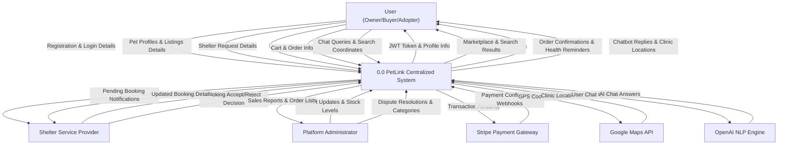

#### 2. Data Flow Diagram Level 1 (Process Decomposition)
The Level 1 DFD decomposes the system into core sub-processes, mapping data flows between processes, external actors, and the persistent collections (Data Stores).

```mermaid
graph TD
    %% Entities
    U["User (Owner/Buyer/Adopter)"]
    SP["Shelter Service Provider"]
    Admin["Platform Administrator"]
    Stripe["Stripe Payments API"]
    Maps["Google Maps API"]
    OpenAI["OpenAI NLP API"]

    %% Data Stores
    D1[("D1: Users DB")]
    D2[("D2: Pets & Listings DB")]
    D3[("D3: Bookings DB")]
    D4[("D4: Products & Orders DB")]
    D5[("D5: Health Records DB")]
    D6[("D6: Chat Logs DB")]

    %% Processes
    P1["1.0 Authenticate & Manage Users"]
    P2["2.0 Manage Pet Profiles & Listings"]
    P3["3.0 Manage Boarding Bookings"]
    P4["4.0 Process Store Orders & Payments"]
    P5["5.0 Run Health Vault & Reminders"]
    P6["6.0 Process AI Chatbot Queries"]
    P7["7.0 Lookup Nearby Clinics"]

    %% Flows for P1
    U -- "Credentials / Profile Details" --> P1
    P1 -- "Read/Write User Data" --> D1
    P1 -- "Token & Profile Info" --> U

    %% Flows for P2
    U -- "Pet & Listing Details" --> P2
    P2 -- "Read/Write Pet/Listing Data" --> D2
    P2 -- "Feed & Listing Status" --> U

    %% Flows for P3
    U -- "Shelter Request Dates" --> P3
    SP -- "Accept / Reject Decision" --> P3
    P3 -- "Read/Write Booking Details" --> D3
    P3 -- "Booking Status Notification" --> U
    P3 -- "Booking Request Details" --> SP

    %% Flows for P4
    U -- "Cart & Order Info" --> P4
    Admin -- "Product Inventory & Stock" --> P4
    P4 -- "Read/Write Product/Order Data" --> D4
    P4 -- "Transaction Request" --> Stripe
    Stripe -- "Payment Success Hook" --> P4
    P4 -- "Invoice & Order Status" --> U
    P4 -- "Order Logs & Sales Reports" --> Admin

    %% Flows for P5
    U -- "Vaccination details" --> P5
    P5 -- "Read/Write Health Logs" --> D5
    P5 -- "Vaccination Reminders" --> U

    %% Flows for P6
    U -- "Chatbot message" --> P6
    P6 -- "Read/Write Session Context" --> D6
    P6 -- "Query Payload" --> OpenAI
    OpenAI -- "AI Reply Text" --> P6
    P6 -- "Chatbot response" --> U

    %% Flows for P7
    U -- "Search request (GPS coordinates)" --> P7
    P7 -- "Location Request" --> Maps
    Maps -- "Clinics metadata" --> P7
    P7 -- "Clinic Map Markers" --> U
```

---

## 4. UML Diagrams

### 4.1 Sequence Diagrams

#### 1. User Authentication
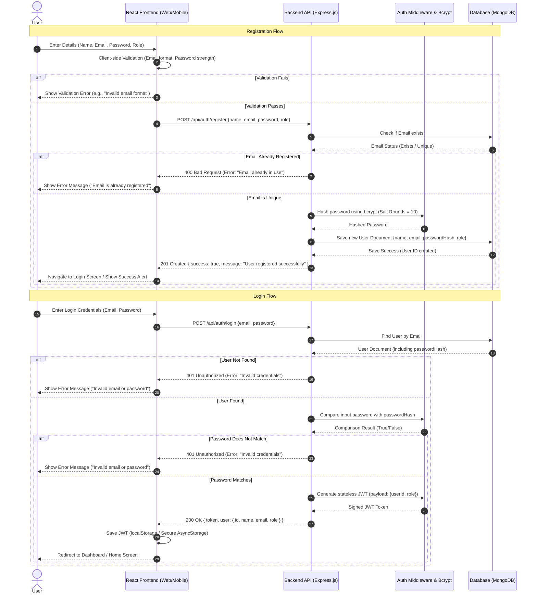

#### 2. Pet Marketplace Purchase
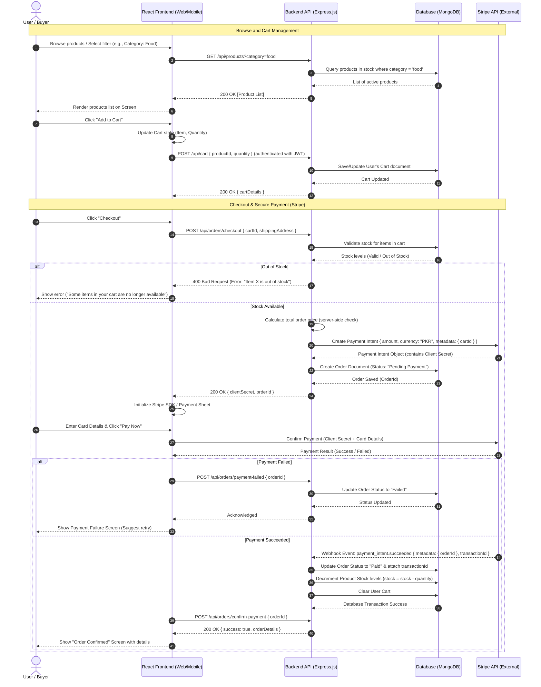

#### 3. Shelter Service Request
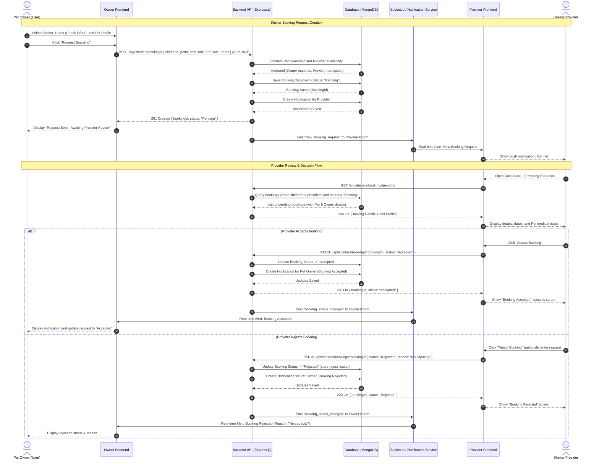

#### 4. Create Listing (Adoption/Sale)
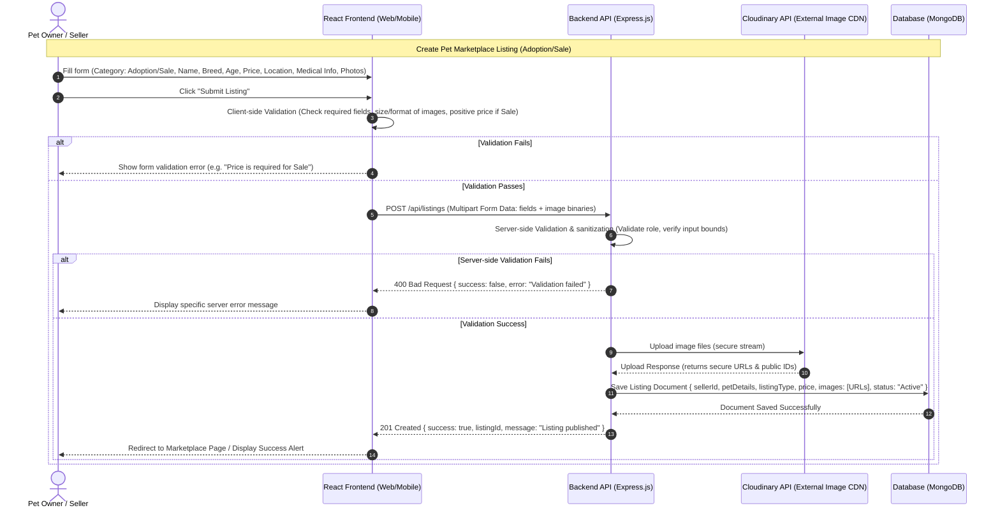

#### 5. AI Chatbot Interaction
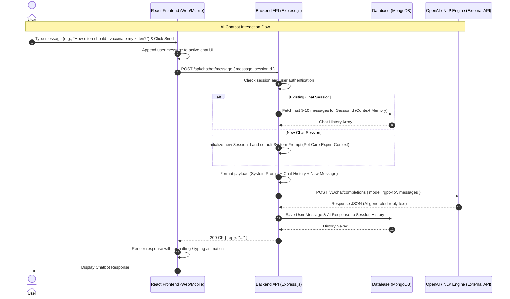

#### 6. Vaccination Reminder
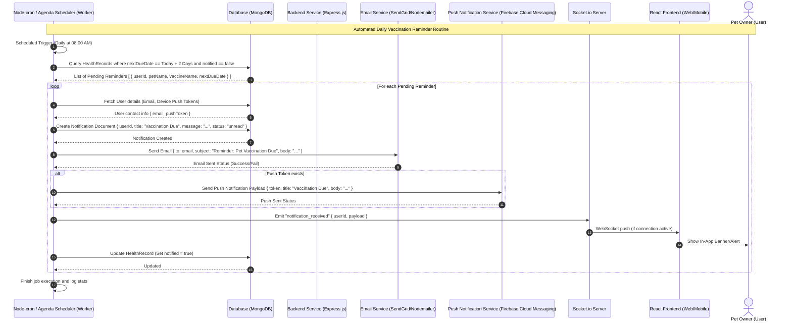

#### 7. Admin Product Management
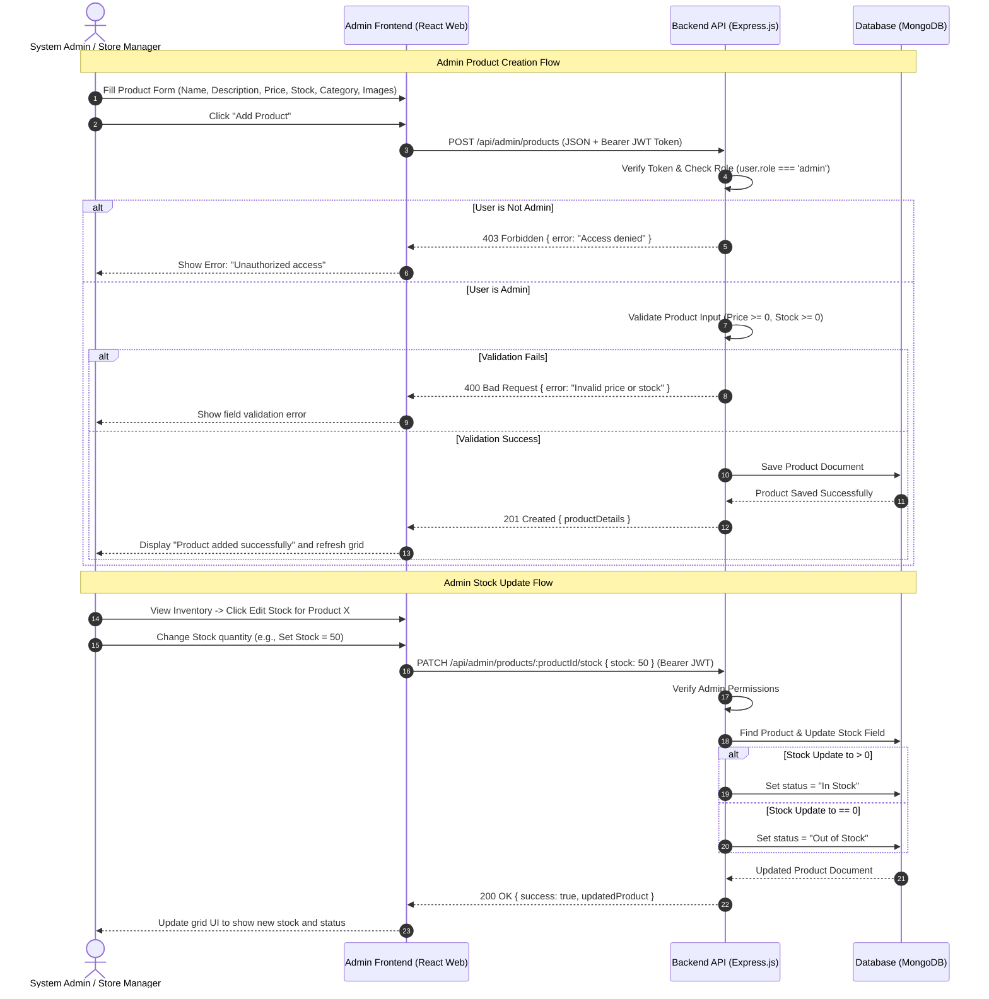

#### 8. Find Nearby Clinics
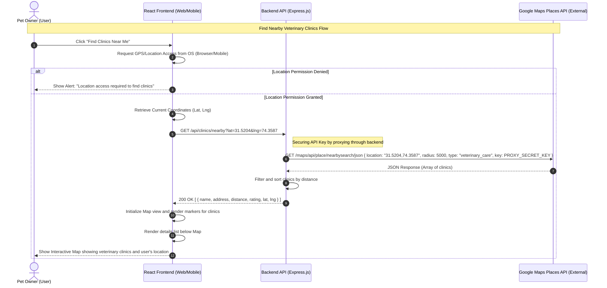

---

### 4.2 Class Diagram
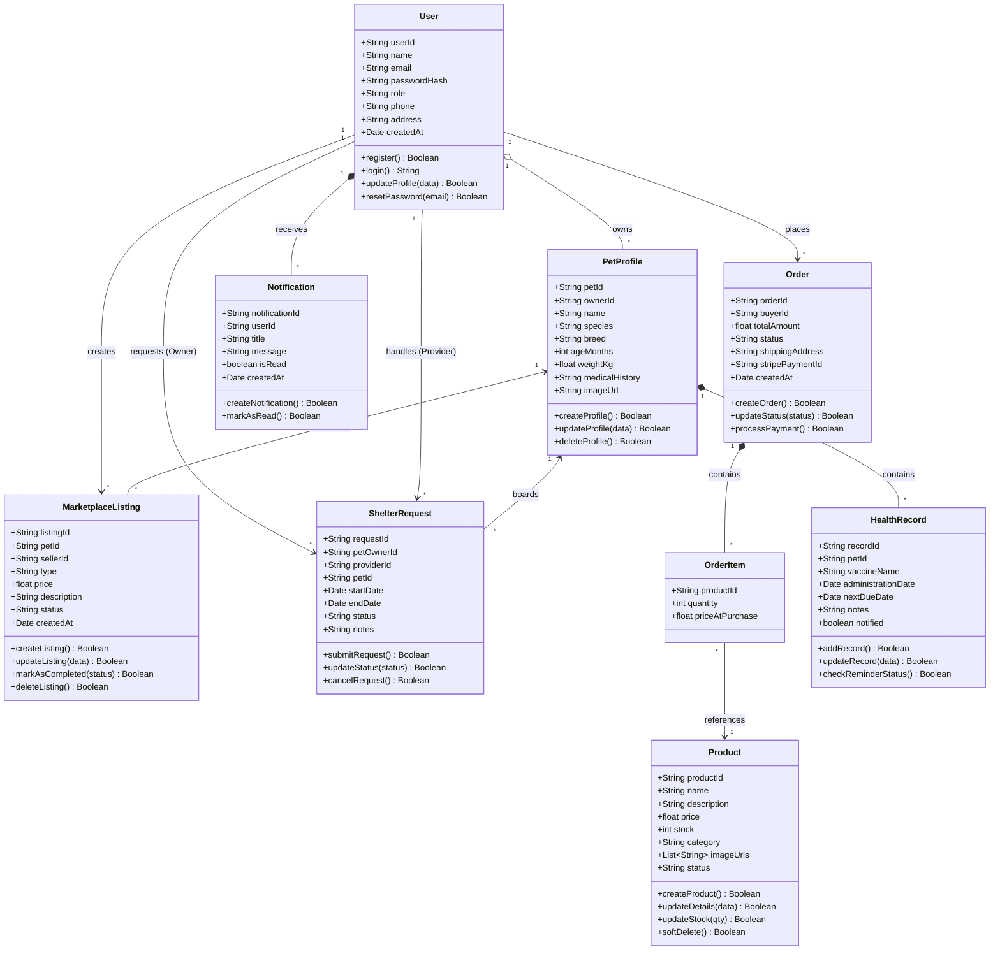

---

## 5. Database Design (ERD)

### 5.1 ER Diagram
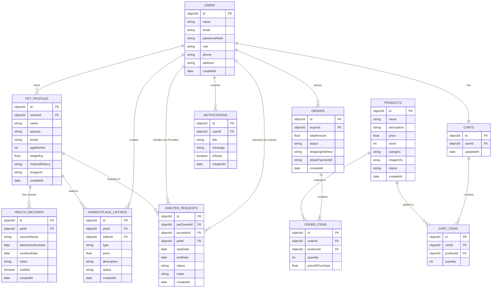

### 5.2 Schema Tables

**User Table**
| **Field Name** | **Data Type** | **Attributes** |
| ------ | ------ | ------ |
| user_id | INT | Primary Key, Auto Increment |
| Name | VARCHAR(100) | NOT NULL |
| Email | VARCHAR(100) | UNIQUE, NOT NULL |
| Phone_number | VARCHAR(15) | UNIQUE |
| Password | VARCHAR(255) | NOT NULL |
| role | VARCHAR(20) | NOT NULL |

**PetProfile Table**
| **Field Name** | **Data Type** | **Attributes** |
| ------ | ------ | ------ |
| pet_id | INT | Primary Key, Auto Increment |
| owner_id | INT | Foreign Key |
| name | VARCHAR(50) | NOT NULL |
| species | VARCHAR(30) | NOT NULL |
| breed | VARCHAR(50) | NOT NULL |
| age_months | INT | NOT NULL |
| weight_kg | DOUBLE | NOT NULL |
| medical_history | TEXT | NULL |
| image_url | VARCHAR(255) | NOT NULL |

**MarketplaceListing Table**
| **Field Name** | **Data Type** | **Attributes** |
| ------ | ------ | ------ |
| listing_id | INT | Primary Key, Auto Increment |
| pet_id | INT | Foreign Key |
| seller_id | INT | Foreign Key |
| type | VARCHAR(15) | NOT NULL |
| price | DOUBLE | DEFAULT 0.0 |
| description | TEXT | NOT NULL |
| status | VARCHAR(20) | DEFAULT 'active' |
| created_at | DATETIME | NOT NULL |

**ShelterRequest Table**
| **Field Name** | **Data Type** | **Attributes** |
| ------ | ------ | ------ |
| request_id | INT | Primary Key, Auto Increment |
| pet_owner_id | INT | Foreign Key |
| provider_id | INT | Foreign Key |
| pet_id | INT | Foreign Key |
| start_date | DATE | NOT NULL |
| end_date | DATE | NOT NULL |
| status | VARCHAR(20) | DEFAULT 'pending' |
| notes | TEXT | NULL |

**Product Table**
| **Field Name** | **Data Type** | **Attributes** |
| ------ | ------ | ------ |
| product_id | INT | Primary Key, Auto Increment |
| name | VARCHAR(100) | NOT NULL |
| description | TEXT | NOT NULL |
| price | DOUBLE | NOT NULL |
| stock | INT | DEFAULT 0 |
| category | VARCHAR(50) | NOT NULL |
| image_url | VARCHAR(255) | NOT NULL |
| status | VARCHAR(20) | DEFAULT 'in_stock' |

**Order Table**
| **Field Name** | **Data Type** | **Attributes** |
| ------ | ------ | ------ |
| order_id | INT | Primary Key, Auto Increment |
| buyer_id | INT | Foreign Key |
| total_amount | DOUBLE | NOT NULL |
| status | VARCHAR(20) | DEFAULT 'pending' |
| shipping_address | VARCHAR(255) | NOT NULL |
| stripe_payment_id | VARCHAR(255) | UNIQUE, NULL |
| created_at | DATETIME | NOT NULL |

**OrderItem Table**
| **Field Name** | **Data Type** | **Attributes** |
| ------ | ------ | ------ |
| item_id | INT | Primary Key, Auto Increment |
| order_id | INT | Foreign Key |
| product_id | INT | Foreign Key |
| quantity | INT | NOT NULL |
| price_at_purchase | DOUBLE | NOT NULL |

**HealthRecord Table**
| **Field Name** | **Data Type** | **Attributes** |
| ------ | ------ | ------ |
| record_id | INT | Primary Key, Auto Increment |
| pet_id | INT | Foreign Key |
| vaccine_name | VARCHAR(100) | NOT NULL |
| administration_date | DATE | NOT NULL |
| next_due_date | DATE | NOT NULL |
| notes | TEXT | NULL |
| notified | BOOLEAN | DEFAULT FALSE |

**Notification Table**
| **Field Name** | **Data Type** | **Attributes** |
| ------ | ------ | ------ |
| notification_id | INT | Primary Key, Auto Increment |
| user_id | INT | Foreign Key |
| notification_message | TEXT | NOT NULL |
| notification_type | VARCHAR(50) | NOT NULL |
| is_read | BOOLEAN | DEFAULT FALSE |
| created_at | DATETIME | NOT NULL |

**Cart Table**
| **Field Name** | **Data Type** | **Attributes** |
| ------ | ------ | ------ |
| cart_id | INT | Primary Key, Auto Increment |
| user_id | INT | Foreign Key, UNIQUE |
| updated_at | DATETIME | NOT NULL |

**CartItem Table**
| **Field Name** | **Data Type** | **Attributes** |
| ------ | ------ | ------ |
| cart_item_id | INT | Primary Key, Auto Increment |
| cart_id | INT | Foreign Key |
| product_id | INT | Foreign Key |
| quantity | INT | DEFAULT 1 |

**ChatHistory Table**
| **Field Name** | **Data Type** | **Attributes** |
| ------ | ------ | ------ |
| chat_id | INT | Primary Key, Auto Increment |
| session_id | VARCHAR(100) | NOT NULL |
| user_id | INT | Foreign Key |
| message | TEXT | NOT NULL |
| sender_type | VARCHAR(20) | NOT NULL |
| created_at | DATETIME | NOT NULL |

---

## 6. API Design

| **Endpoint** | **Method** | **Input** | **Output** |
| ------ | ------ | ------ | ------ |
| /api/auth/register | POST | name, email, password, role | User registration confirmation |
| /api/auth/login | POST | email, password | Authentication token + user details |
| /api/auth/profile | PUT | userId, name, phone, address | Updated user profile |
| /api/pets | POST | ownerId, name, species, breed, ageMonths, weightKg, imageUrl | Pet profile creation confirmation |
| /api/pets | GET | ownerId | List of owned pet profiles |
| /api/listings | POST | petId, sellerId, type, price, description | Marketplace listing creation confirmation |
| /api/listings | GET | type, category, search, location | List of matching active listings |
| /api/listings/{id}/status | PUT | listingId, status | Updated listing details |
| /api/shelters/bookings | POST | petOwnerId, providerId, petId, startDate, endDate, notes | Booking request confirmation |
| /api/shelters/bookings/pending | GET | providerId | Pending boarding requests |
| /api/shelters/bookings/{id}/status | PATCH | bookingId, status | Updated booking status |
| /api/products | GET | category, search | List of matching shop products |
| /api/admin/products | POST | name, description, price, stock, category, imageUrls | Product creation confirmation |
| /api/admin/products/{id}/stock | PATCH | productId, stock | Updated product inventory |
| /api/orders/checkout | POST | cartId, shippingAddress | Stripe Payment Intent clientSecret + orderId |
| /api/orders/confirm-payment | POST | orderId | Payment confirmation status |
| /api/chatbot/message | POST | message, sessionId | AI reply message |
| /api/clinics/nearby | GET | latitude, longitude | List of nearby veterinary clinics |
| /api/notifications | GET | userId | List of active notifications |
| /api/logout | POST | userId | Logout confirmation |

---

## 7. UI/UX Design (Prototypes)
*Wireframes: Low-fidelity sketches (black and white boxes).*  
*Navigation Flow: A flowchart showing how a user gets from Screen A to Screen B.*  
*Screens: High-fidelity mockups (what the final app actually looks like).*  

---

## 8. Sprint-wise Design Evolution

| **Sprint** | **Features Designed** | **Improvements** |
| ------ | ------ | ------ |
| **Sprint 1** | SRS alignment, authentication modules, user profile structure | Implemented JWT-based session architecture rather than simple cookies for cross-platform integration. |
| **Sprint 2** | Pet profile CRUD systems, marketplace listing pages, search feed | Added database indexing on search query keys to handle high concurrent search loads. |
| **Sprint 3** | Boarding request flows, shelter dashboards, notification layers | Configured Socket.io real-time triggers to keep booking status states live. |
| **Sprint 4** | E-commerce storefront backend, inventory manager | Isolated transaction logs from the core products table to prevent race conditions during checkout. |
| **Sprint 5** | Stripe payment checkout integration, webhook monitors | Implemented automated payment webhooks to protect orders against client network drops. |
| **Sprint 6** | OpenAI Chatbot dialog systems, Google Maps locator | Proxying Maps API calls through the backend to keep api keys hidden from client source code. |
| **Sprint 7** | ER Diagram, Class Diagram, detailed Schema Tables | Adjusted schemas to handle SQL-like relationships for clear structural reporting. |
| **Sprint 8** | Final design audit and documentation updates | Normalized schemas and completed UCP-spec sprint evolution logs. |

---

## 9. Test Design

| **Test ID** | **Scenario** | **Expected Result** |
| ------ | ------ | ------ |
| TC-01 | User enters valid login credentials | System logs in user and returns a signed JWT. |
| TC-02 | User enters incorrect password | System displays "Invalid Credentials" error. |
| TC-03 | User registers with an existing email | System displays "Email already in use" error. |
| TC-04 | User leaves required fields empty on signup | System displays validation error for required fields. |
| TC-05 | Pet owner creates a pet profile | Pet record is successfully created in the database. |
| TC-06 | Seller lists a pet for sale with a negative price | System blocks submission and displays a pricing error. |
| TC-07 | Seller lists a pet for adoption with a price > 0 | System blocks submission and enforces free adoption. |
| TC-08 | Buyer applies filters on marketplace feed | Feed displays listings matching only selected filters. |
| TC-09 | Pet owner requests boarding shelter | Shelter booking request status is saved as 'pending'. |
| TC-10 | Provider accepts a boarding request | Request status changes from 'pending' to 'accepted'. |
| TC-11 | Provider rejects a boarding request | Request status changes from 'pending' to 'rejected'. |
| TC-12 | Admin uploads a new storefront product | Product is stored and visible on the user storefront. |
| TC-13 | Admin attempts to set negative inventory levels | System rejects update and displays validation error. |
| TC-14 | User attempts to add out-of-stock item to cart | System blocks addition and displays "Out of Stock" banner. |
| TC-15 | User updates product quantity in cart | Cart total adjusts according to new quantity. |
| TC-16 | Buyer checks out with invalid card details | Stripe rejects payment and returns error code to client. |
| TC-17 | Stripe checkout transaction completes successfully | Order status changes to 'paid' and product stock decreases. |
| TC-18 | Daily cron task detects vaccine due in 2 days | Background task triggers email and push notifications. |
| TC-19 | User queries AI chatbot with pet medical questions | Chatbot returns basic guidance with emergency vet warning. |
| TC-20 | User searches for nearby veterinary clinics | Map displays markers for veterinary care facilities near GPS coordinates. |
| TC-21 | User disables location services on device | System displays location permission warning. |
| TC-22 | User logs out of their active session | Session is terminated and client-side token is cleared. |
| TC-23 | Multiple orders process for the last unit of stock | First transaction finishes, and subsequent checkouts fail. |
| TC-24 | Admin reviews monthly sales reports | Dashboard displays transaction history and revenue summaries. |
| TC-25 | Network connection is lost during Stripe checkout | Webhook updates order status once connection is restored. |

---

## 10. Design Quality Attributes

**Scalability:** The PetLink system utilizes a modular 3-Tier Layered Client-Server Architecture. By decoupling the client apps (React/React Native) from the Express.js business logic, we can scale servers horizontally under load balancers. The MongoDB Atlas instance supports replica sets for read/write scaling, while search indices ensure performance remains high when concurrent queries exceed 10,000 requests.

**Security:** Password hashes are generated using `bcrypt`. Communication is encrypted via HTTPS/TLS. Secure JWT tokens control access to protected API routes. Stripe takes care of raw card numbers directly, meaning PetLink servers are excluded from storing payment credentials.

**Maintainability:** Clean folder structures isolate routers, database models, request validations, and cron tasks. Versioning in routing paths (e.g., `/api/v1`) ensures client updates do not break core APIs.

**Performance:** Lightweight controllers and backend proxying for Google Maps API queries minimize response delays. Compound indexes in the database optimize queries for listings.

**Reliability:** Webhooks are integrated to keep checkout records consistent even during network dropouts, and replica database setups protect against service outages.

**Usability:** Responsive web and mobile frontends allow users to manage pet profiles, purchase products, or track vaccinations quickly.

---

## 11. Deployment Considerations

**Hosting:** The React.js admin portal is hosted on Vercel. The Express.js backend runs on Render containers. The React Native mobile apps are distributed via Google Play Store and Apple App Store.

**Database:** MongoDB Atlas manages database clusters, automates daily database backups, and handles replica scaling.

**Version Control:** The team collaborates on GitHub using a feature-branch strategy. Direct commits to the `main` branch are restricted. Merges require code reviews and validation testing on the `develop` branch.

---

## 12. Future Enhancements

| **Future Feature** | **Description** |
| ------ | ------ |
| AI Smart Adopter Matching | Connects pet characteristics to adopter profiles using matching algorithms. |
| Offline Health Vault Logging | Allows users to log vaccine schedules offline and syncs them once internet returns. |
| Integrated Telehealth Consultations| Integrates live video consultations between users and veterinary clinics. |
| Local E-Payment Gateways | Adds direct support for local Pakistani payment channels like JazzCash and EasyPaisa. |

---

## 13. Revised Project Plan
*Gantt charts and project timelines are managed in Microsoft Project, tracking milestones across sprints 1 through 8 to ensure deadlines align with final year deliverables.*

---

## 14. References
*   Sommerville, I., *Software Engineering*, 10th Edition, Pearson, 2016.
*   Pressman, R. S., and Maxim, B. R., *Software Engineering: A Practitioner’s Approach*, 9th Edition, McGraw-Hill, 2019.
*   React.js Foundation, *React Documentation*, Available at: https://react.dev
*   MongoDB Inc., *MongoDB Atlas Manual*, Available at: https://www.mongodb.com/docs
*   Stripe API reference, Available at: https://stripe.com/docs/api
*   Google Maps Platform, Available at: https://developers.google.com/maps/documentation

---

## Appendix A: Glossary
*   **MERN:** MongoDB, Express.js, React.js, Node.js development stack.
*   **JWT:** JSON Web Token for stateless authorization.
*   **FCM:** Firebase Cloud Messaging push system.
*   **Bcrypt:** Password hashing algorithm.
*   **UML:** Unified Modeling Language.

---

## Appendix B: IV & V Report
**(Independent verification & validation)**

**IV & V Resource**  
Name: Usama (Database and QA Specialist)  

| **S#** | **Defect Description** | **Origin Stage** | **Status** | **Fix Time (Hours)** | **Fix Time (Minutes)** |
| ------ | ------ | ------ | ------ | ------ | ------ |
| 1 | Missing transaction isolation logs for parallel checkouts | Database | Fixed | 1 | 30 |
| 2 | Insecure client-side exposure of Google Maps API key | Security | Fixed | 2 | 0 |
| 3 | Lack of status boundaries for negative e-store pricing | E-commerce | Fixed | 0 | 45 |

**Table 1: List of non-trivial defects**

| | |
| --- | --- |
| **University of Central Punjab** | *(Incorporated by Ordinance No. XXIV of 2002 promulgated by Government of the Punjab)* |

**Faculty of Information Technology and Computer Science**

**Semester wise SDP Meeting Report**

| **Group ID** | **Student Roll Number** | **Student Name and Signatures** | **Advisor** |
| ------ | ------ | ------ | ------ |
| S26SE025 | L1F22BSSE0286 | Nabeel Ijaz | Zupash Awais |
| | L1F22BSSE0297 | Ehsan Shahid | |
| | L1S23BSSE0100 | Umar Akram | |
| | L1S23BSSE0089 | Usama | |

| **Sr.** | **Date** | **Status (P/A/L) Student 1** | **Student 2** | **Student 3** | **Student 4** | **Agenda Items** | **Notes** |
| ------ | ------ | ------ | ------ | ------ | ------ | ------ | ------ |
| 1 | | P | P | P | P | Sprint 1 Goals Setup | Discussed Auth structure |
| 2 | | P | P | P | P | Sprint 2 Review | Pet Profiles CRUD check |
| 3 | | P | P | P | P | Sprint 3 Goals | Boarding request flows |
| 4 | | P | P | P | P | Sprint 4 Check | E-store database layout |
| 5 | | P | P | P | P | Sprint 5 Integrations | Stripe API test plans |
| 6 | | P | P | P | P | Sprint 6 AI Chatbot | OpenAI response check |
| 7 | | P | P | P | P | Sprint 7 UML Review | ERD and Class designs |
| 8 | | P | P | P | P | Final SDP Assessment | Phase II documentation review |
| 9 | | P | P | P | P | Verification check | QA validations and corrections |
| 10 | | P | P | P | P | Submission prep | Final review with advisor |

Date: ________________________ Advisor's Signatures: ________________________________
