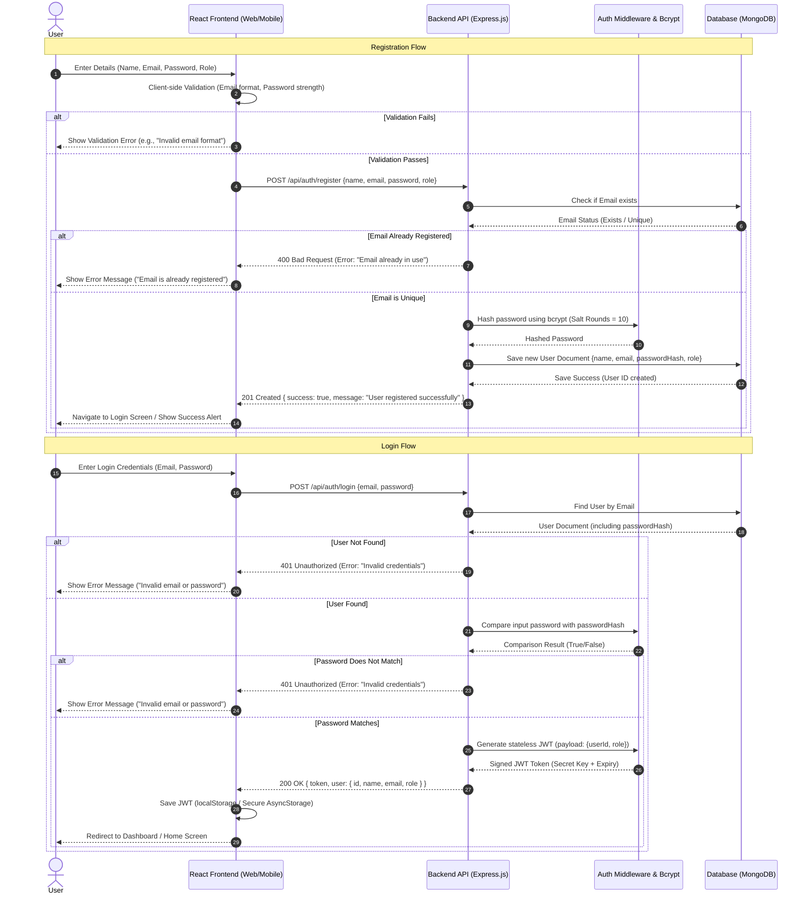
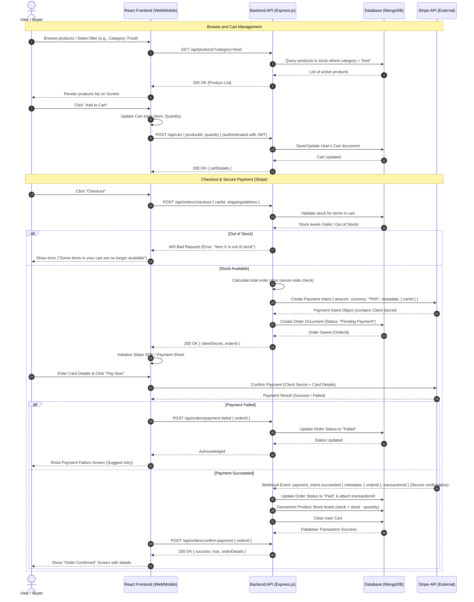
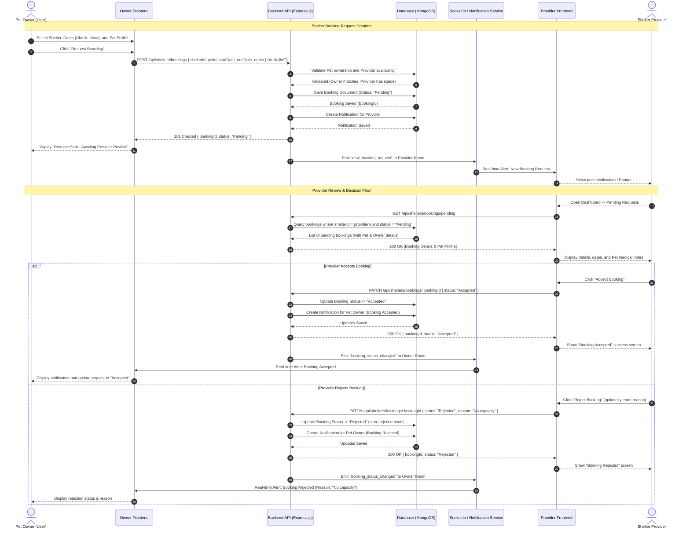
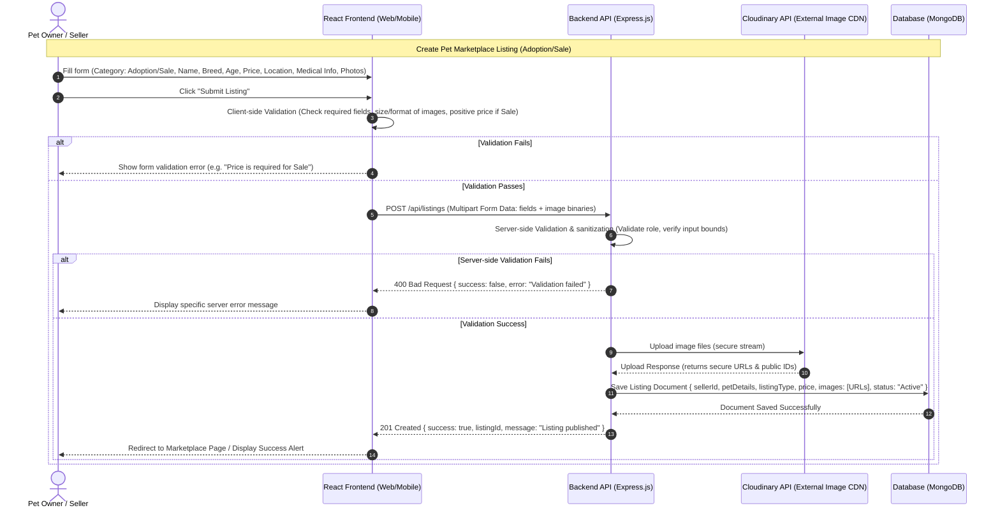
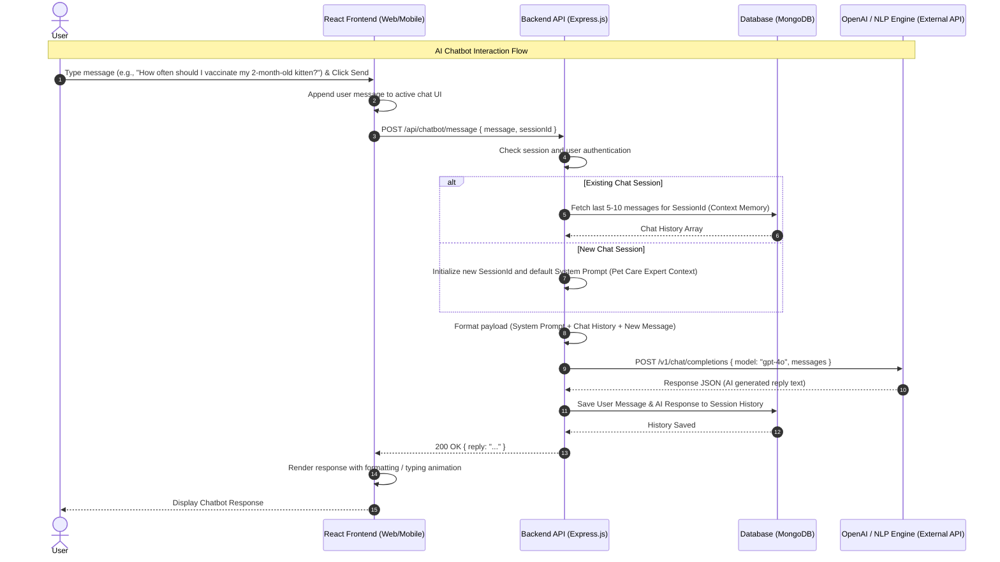
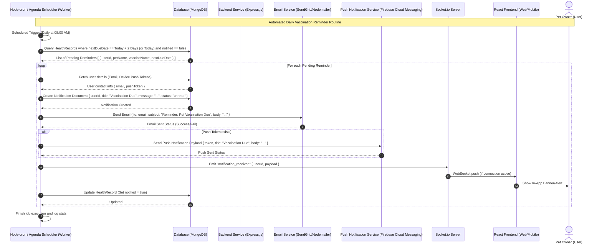
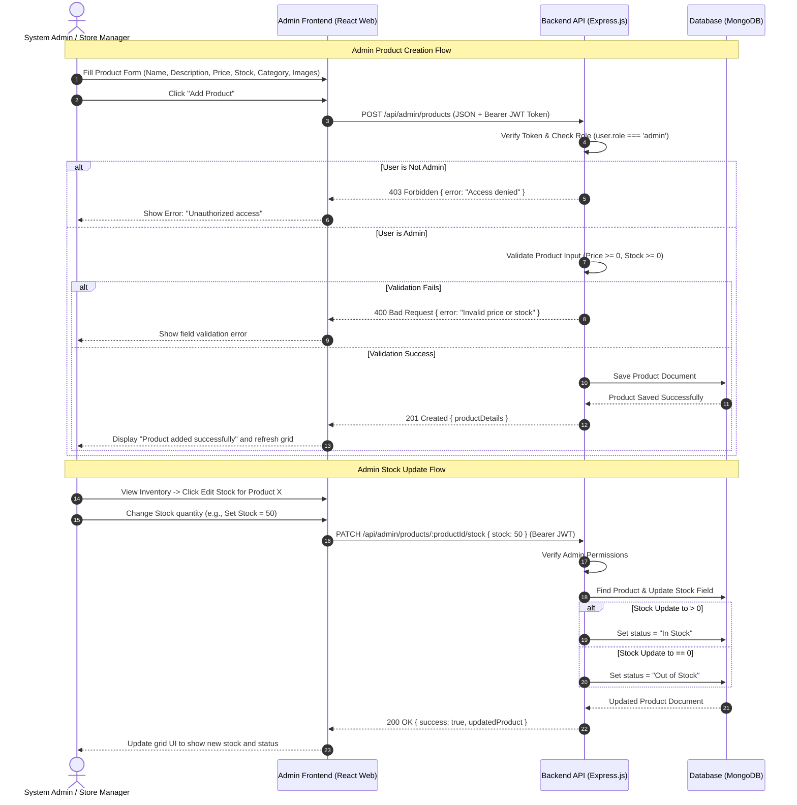
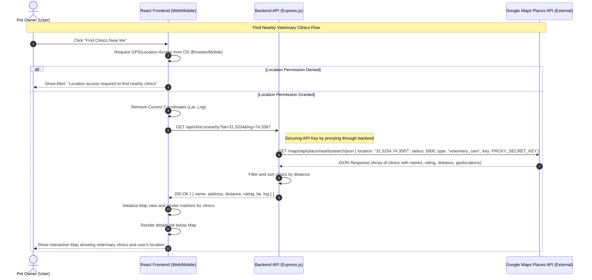
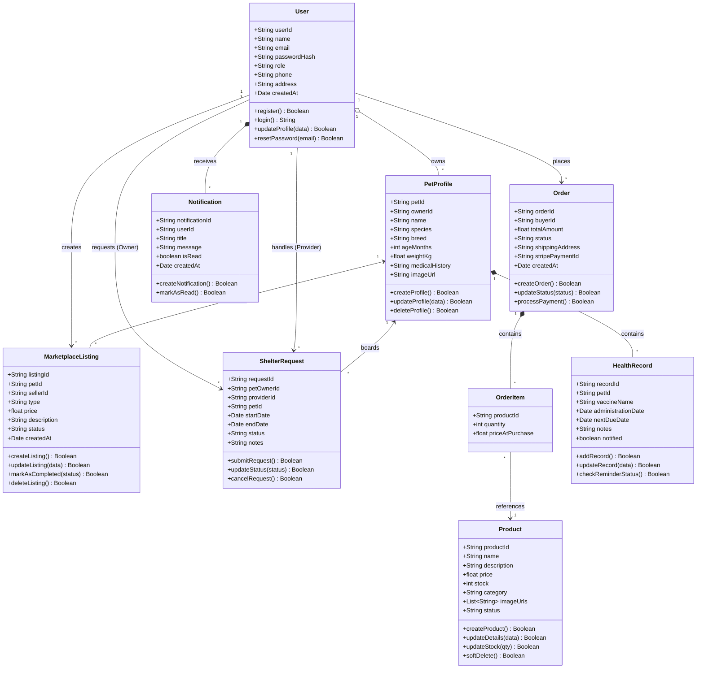
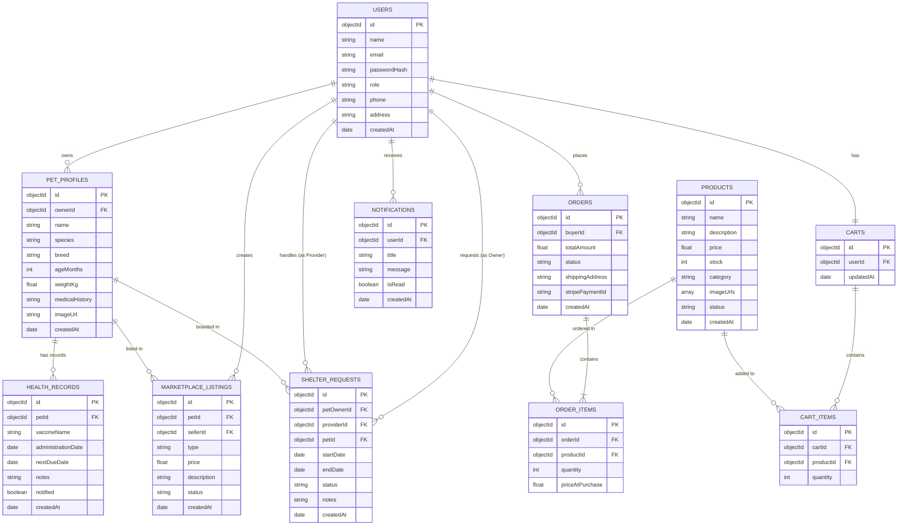

# PetLink - Phase 2: UML Diagrams & Database Design

This document contains the detailed system architecture diagrams and database designs in **Mermaid.js** syntax for Section 4 (UML Diagrams) and Section 5 (Database Design) of the Phase 2 (Agile Software Design Specification) document.

---

## Section 4: UML Diagrams

### 4.1 Sequence Diagrams
These diagrams illustrate the step-by-step logic and communications between the User, React Frontend, Backend API, Database, and external service providers.

#### 1. User Authentication
Covers user registration, validation, secure login using JWT tokens, bcrypt password comparison, and robust error handling.

---

#### 2. Pet Marketplace Purchase
Handles browsing items, adding products to the shopping cart, initiating checkout, securing payment via the Stripe API, and processing order confirmation backend-side.

---

#### 3. Shelter Service Request
Represents the request-and-response workflow between a Pet Owner seeking temporary shelter/boarding and a Service Provider.

---

#### 4. Create Listing (Adoption/Sale)
Details how a pet owner submits details, uploads image files, gets them validated, uploads them to Cloudinary CDN, and saves the listing.

---

#### 5. AI Chatbot Interaction
Triggers when a user enters a query, fetches conversation context memory, queries OpenAI API, and saves/returns the response.

---

#### 6. Vaccination Reminder
A background daily scheduler checks pet health records for upcoming vaccine due dates, and pushes multi-channel alerts (email, push, and web sockets).

---

#### 7. Admin Product Management
Illustrates an authorized administrator adding new items or updating stock levels with immediate visibility changes based on inventory level.

---

#### 8. Find Nearby Clinics
Enables a user to query clinics, using GPS tracking permission, and securely calling Google Maps API proxied through the backend API.

---

### 4.2 Class Diagram
A comprehensive Class Diagram showing the core system objects, attributes, methods, and structural relationships (Aggregation, Composition, Association).

---

## Section 5: Database Design

### 5.1 Entity-Relationship Diagram (ERD)
The database for PetLink is structured using MongoDB (NoSQL). The ERD maps out the collections, their fields, field types, and the logical referencing relationships between collections.

---

### 5.2 Schema Tables
Below is the technical specification of the field constraints, data types, indexes, and keys for the PetLink database schema.

#### 1. Users Collection
Stores details for all actors (Adopters, Sellers, Owners, Service Providers, and Admins).

| Field Name | Data Type | Key/Index | Required? | Constraints & Details |
| :--- | :--- | :--- | :--- | :--- |
| `_id` | ObjectId | PK | Yes | Auto-generated by MongoDB |
| `name` | String | | Yes | Length: 3 - 50 chars |
| `email` | String | Unique | Yes | Valid email format, indexed |
| `passwordHash` | String | | Yes | Bcrypt-hashed password |
| `role` | String | | Yes | Enum: `['admin', 'buyer', 'seller', 'shelter_provider']` |
| `phone` | String | | No | Format check for Pakistani numbers |
| `address` | String | | No | User's physical location info |
| `createdAt` | Date | | Yes | Defaults to `Date.now()` |

#### 2. PetProfiles Collection
Stores profile details of pets owned by users.

| Field Name | Data Type | Key/Index | Required? | Constraints & Details |
| :--- | :--- | :--- | :--- | :--- |
| `_id` | ObjectId | PK | Yes | Auto-generated |
| `ownerId` | ObjectId | FK, Index | Yes | References `Users._id` |
| `name` | String | | Yes | Name of the pet |
| `species` | String | | Yes | e.g., `'Cat'`, `'Dog'`, `'Rabbit'` |
| `breed` | String | | Yes | Breed of the pet |
| `ageMonths` | Number | | Yes | Must be >= 0 |
| `weightKg` | Number | | Yes | Decimal representation, must be > 0 |
| `medicalHistory` | String | | No | Notes on allergies or chronic conditions |
| `imageUrl` | String | | Yes | Direct image link from Cloudinary |
| `createdAt` | Date | | Yes | Defaults to `Date.now()` |

#### 3. MarketplaceListings Collection
Stores active and completed pet trading listings (Adoption and Sale).

| Field Name | Data Type | Key/Index | Required? | Constraints & Details |
| :--- | :--- | :--- | :--- | :--- |
| `_id` | ObjectId | PK | Yes | Auto-generated |
| `petId` | ObjectId | FK, Index | Yes | References `PetProfiles._id` |
| `sellerId` | ObjectId | FK, Index | Yes | References `Users._id` |
| `type` | String | | Yes | Enum: `['adoption', 'sale']` |
| `price` | Number | | Yes | Required if type is `'sale'`, else must be `0` |
| `description` | String | | Yes | Text details about listing |
| `status` | String | | Yes | Enum: `['active', 'sold', 'adopted', 'inactive']` |
| `createdAt` | Date | | Yes | Defaults to `Date.now()` |

#### 4. ShelterRequests Collection
Manages temporary boarding booking requests submitted by owners and accepted/rejected by shelter providers.

| Field Name | Data Type | Key/Index | Required? | Constraints & Details |
| :--- | :--- | :--- | :--- | :--- |
| `_id` | ObjectId | PK | Yes | Auto-generated |
| `petOwnerId` | ObjectId | FK, Index | Yes | References `Users._id` (Pet Owner) |
| `providerId` | ObjectId | FK, Index | Yes | References `Users._id` (Shelter Provider) |
| `petId` | ObjectId | FK | Yes | References `PetProfiles._id` |
| `startDate` | Date | | Yes | Boarding start date |
| `endDate` | Date | | Yes | Boarding end date, must be >= `startDate` |
| `status` | String | | Yes | Enum: `['pending', 'accepted', 'rejected', 'cancelled']` |
| `notes` | String | | No | Special care instructions |
| `createdAt` | Date | | Yes | Defaults to `Date.now()` |

#### 5. Products Collection
Stores pet products managed by Admin and displayed in the User StoreFront.

| Field Name | Data Type | Key/Index | Required? | Constraints & Details |
| :--- | :--- | :--- | :--- | :--- |
| `_id` | ObjectId | PK | Yes | Auto-generated |
| `name` | String | | Yes | Product name |
| `description` | String | | Yes | Detailed product specification |
| `price` | Number | | Yes | Must be >= 0 |
| `stock` | Number | | Yes | Integer quantity, must be >= 0 |
| `category` | String | | Yes | Enum: `['food', 'medicine', 'accessories', 'toys']` |
| `imageUrls` | Array (String) | | Yes | Array of Cloudinary links |
| `status` | String | | Yes | Enum: `['in_stock', 'out_of_stock']` |
| `createdAt` | Date | | Yes | Defaults to `Date.now()` |

#### 6. Orders Collection
Stores product sales history and shipping status.

| Field Name | Data Type | Key/Index | Required? | Constraints & Details |
| :--- | :--- | :--- | :--- | :--- |
| `_id` | ObjectId | PK | Yes | Auto-generated |
| `buyerId` | ObjectId | FK, Index | Yes | References `Users._id` |
| `totalAmount` | Number | | Yes | Must be >= 0 |
| `status` | String | | Yes | Enum: `['pending', 'paid', 'shipped', 'delivered', 'cancelled']` |
| `shippingAddress` | String | | Yes | Shipping address details |
| `stripePaymentId` | String | Unique | No | Store reference for transactions |
| `createdAt` | Date | | Yes | Defaults to `Date.now()` |

#### 7. OrderItems Collection
Links items in an order to the primary `Orders` table.

| Field Name | Data Type | Key/Index | Required? | Constraints & Details |
| :--- | :--- | :--- | :--- | :--- |
| `_id` | ObjectId | PK | Yes | Auto-generated |
| `orderId` | ObjectId | FK, Index | Yes | References `Orders._id` |
| `productId` | ObjectId | FK | Yes | References `Products._id` |
| `quantity` | Number | | Yes | Integer, must be >= 1 |
| `priceAtPurchase` | Number | | Yes | Remembers price at time of sale |

#### 8. HealthRecords Collection
Stores medical events and vaccinations for automated triggers.

| Field Name | Data Type | Key/Index | Required? | Constraints & Details |
| :--- | :--- | :--- | :--- | :--- |
| `_id` | ObjectId | PK | Yes | Auto-generated |
| `petId` | ObjectId | FK, Index | Yes | References `PetProfiles._id` |
| `vaccineName` | String | | Yes | e.g. `'Rabies'`, `'FVRCP'` |
| `administrationDate`| Date | | Yes | Date vaccine was given |
| `nextDueDate` | Date | Index | Yes | Next scheduled vaccination date |
| `notes` | String | | No | Comments from veterinarian |
| `notified` | Boolean | | Yes | Default: `false`. True once reminder fires |
| `createdAt` | Date | | Yes | Defaults to `Date.now()` |

#### 9. Notifications Collection
Manages alerts sent dynamically to user profiles.

| Field Name | Data Type | Key/Index | Required? | Constraints & Details |
| :--- | :--- | :--- | :--- | :--- |
| `_id` | ObjectId | PK | Yes | Auto-generated |
| `userId` | ObjectId | FK, Index | Yes | References `Users._id` |
| `title` | String | | Yes | Notification heading |
| `message` | String | | Yes | Alert description text |
| `isRead` | Boolean | | Yes | Default: `false` |
| `createdAt` | Date | | Yes | Defaults to `Date.now()` |

#### 10. Carts & CartItems Collections
Handles user carts and items waiting for checkout.

**Carts Table**
| Field Name | Data Type | Key/Index | Required? | Constraints & Details |
| :--- | :--- | :--- | :--- | :--- |
| `_id` | ObjectId | PK | Yes | Auto-generated |
| `userId` | ObjectId | FK, Index | Yes | References `Users._id` (One cart per user) |
| `updatedAt` | Date | | Yes | Timestamp of last modification |

**CartItems Table**
| Field Name | Data Type | Key/Index | Required? | Constraints & Details |
| :--- | :--- | :--- | :--- | :--- |
| `_id` | ObjectId | PK | Yes | Auto-generated |
| `cartId` | ObjectId | FK, Index | Yes | References `Carts._id` |
| `productId` | ObjectId | FK | Yes | References `Products._id` |
| `quantity` | Number | | Yes | Must be >= 1 |
